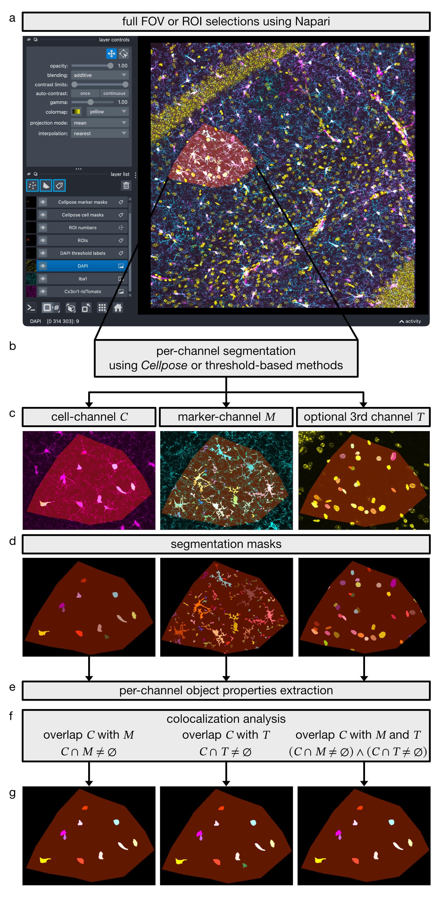

# CellColoc: A Python package for interactive, segmentation-based colocalization analysis in microscopy images

                       

*CellColoc* is a Python package for interactive, segmentation-based colocalization analysis in microscopy images.

It is designed for experiments where you want to:

- segment a larger biological object in one channel, such as soma, cytoplasm, neurites, or another cellular compartment,
- segment or threshold a second channel that defines marker positivity,
- classify cells as marker-positive or marker-negative based on overlap,
- optionally segment a third channel for ROI occupancy quantification and, if desired, third-channel cell positivity,
- inspect and refine results interactively in napari,
- analyze a single microscopy channel when no colocalization step is needed and the main goal is object counting, sizing, and morphology.

The package supports both 2D and 3D data, flexible segmentation backends (we support both [*Cellpose*](https://www.cellpose.org) and classical thresholding), and a range of optional features including optional ROI-based analysis, optional global z-cropping, optional z-projection, and fast post hoc *Cellpose* threshold refinement.

## Core idea
*CellColoc* is built around a simple but flexible model:

- one primary `cell` channel,
- one primary `marker` channel,
- an optional third channel for additional occupancy quantification or optional third-marker positivity analysis,
- an optional single-channel workflow for pure segmentation, counting, occupancy, and morphology analysis.

***Figure 1. CellColoc workflow for object-based multi-channel colocalization analysis in microscopy images.** **(a)** A full field of view (FOV) or user-defined regions of interest (ROIs) are selected interactively in napari. **(b)** Within the selected analysis region, each channel is segmented independently using either Cellpose or threshold-based methods. **(c)** Representative input channels for the cell channel $C$, marker channel $M$, and an optional third channel $T$. **(d)** Corresponding per-channel segmentation masks. **(e)** Per-channel object properties are extracted from the segmented masks. **(f)** Object-based colocalization is then evaluated by testing cell-channel objects for overlap with the marker channel ($C \cap M \neq \varnothing$), with the optional third channel ($C \cap T \neq \varnothing$), or with both channels ($(C \cap M \neq \varnothing) \land (C \cap T \neq \varnothing)$). **(g)** Resulting subsets of cell-channel objects classified as positive for $M$, positive for $T$, or positive for both $M$ and $T$.*

Each analysis channel can use one of several segmentation backends:

- `cellpose`
- `otsu`
- `li`
- `percentile`

This means *CellColoc* is not limited to [*Cellpose*](https://www.cellpose.org)-only workflows. You can mix neural-network segmentation and classical intensity-threshold segmentation channel by channel within the same analysis script.

## What CellColoc does
For each analysis run, the package can:

1. load microscopy images through `omio-microscopy`,
2. resolve voxel size either from user input or OMIO metadata,
3. optionally prepare a global analysis view using z-cropping and/or z-projection,
4. let the user draw 2D ROIs in napari or reuse existing ROI masks,
5. segment a single configured channel for pure object counting and morphology analysis, or segment each configured colocalization channel with *Cellpose* or threshold-based methods,
6. measure overlap between segmented cells and marker objects when a multi-channel colocalization workflow is used,
7. classify each cell as marker-positive or marker-negative,
8. optionally quantify occupancy metrics for every segmented channel,
9. optionally classify cells as positive for the third channel as well,
10. export masks and result tables to a standardized `results/` folder,
11. allow interactive post hoc refinement and manual relabel-based reanalysis.

## Main features
- Interactive user-script workflow for VS Code interactive window or notebook-like execution
- Reusable core package separated from project-specific scripts
- 2D and 3D image handling
- Automatic dimensionality detection from OMIO-loaded `TZCYX` data
- Dedicated single-channel workflow for segmentation, object counting, occupancy, and morphology analysis without colocalization
- Optional ROI drawing in napari
- Optional whole-image analysis as one ROI
- Optional reuse of previously saved ROI masks
- Channel-wise segmentation method selection
- Optional prefilter chains such as `["median", "gaussian"]`
- Optional mask postfilters such as `min_intensity`, `local_contrast`, and `bright_pixel_support`
- Optional anisotropy handling for true 3D *Cellpose* runs
- Optional 3D flow smoothing for *Cellpose*
- Optional global z-crop for internal analysis
- Optional global z-projection using `max`, `mean`, `median`, `std`, or `var`
- Fast *Cellpose* cache-based threshold refinement without rerunning the network forward pass
- Optional manual mask editing in napari followed by table recomputation
- Standardized export of masks, CSV tables, and Excel workbooks

## Repository layout

- `cellcoloc/`
  Reusable package containing image loading, ROI handling, segmentation, colocalization logic, filtering, visualization, export, and runtime helpers.
- `user_scripts/`
  Interactive project-specific scripts that configure real datasets and call the package step by step.
- `example_data/`
  Example datasets and example results.

## Analysis workflow
The recommended workflow is to run a user script cell by cell.

Typical steps are:

1. define paths, channels, and display names,
2. set segmentation methods and model parameters,
3. optionally define z-cropping or z-projection,
4. load and prepare the analysis channels,
5. draw or reload ROIs,
6. run segmentation and colocalization,
7. inspect the masks and tables in napari,
8. optionally refine thresholds or edit masks,
9. export final results.

This structure keeps project settings in the user scripts while the reusable analysis logic stays inside the package.

## Segmentation backends
*CellColoc* currently supports the following segmentation approaches for analysis channels:

- `cellpose`
  Useful for object-centric segmentation of cells, somata, nuclei, or similar structures.
- `otsu`
  Global Otsu thresholding followed by morphology cleanup and connected-component labeling.
- `li`
  Li thresholding followed by morphology cleanup and connected-component labeling.
- `percentile`
  Fixed percentile thresholding followed by morphology cleanup and connected-component labeling.

These methods can be chosen independently for each channel.

## ROIs and 3D behavior
ROIs are drawn as 2D polygons in napari. They are then reused for all downstream computations.

By default:

- a 2D ROI is applied across the analysis stack in `z`,
- segmentation is run only inside the ROI crop bounding box,
- everything outside the ROI mask is zeroed before segmentation.

In addition, *CellColoc* now supports:

- global analysis z-cropping via `z_crop=(start, stop)`,
- global z-projection via `z_projection="max"` or related methods.

If a z-projection is enabled, all later analysis and visualization steps operate on the projected 2D analysis view.

## Marker positivity logic
Cells are segmented from the configured `cell` channel. Marker objects are segmented independently from the configured `marker` channel.

A cell is counted as marker-positive only if:

1. it overlaps at least one marker object,
2. the best overlap reaches `min_overlap_voxels`,
3. the best overlap fraction reaches `overlap_fraction_threshold`.

This rule is explicit and configurable through `ColocalizationConfig`.

## Mathematical definition of colocalization
CellColoc determines colocalization from segmented objects, not from raw
intensity correlation.

For one ROI $R$, let:

- $C_i \subseteq R$ be the pixel or voxel set of segmented cell object $i$,
- $M_j \subseteq R$ be the pixel or voxel set of segmented marker object $j$,
- $M = \bigcup_j M_j$ be the union of all marker-positive pixels or voxels in
  that ROI.

For each cell object $C_i$, CellColoc computes the overlap with the marker
segmentation as:

$$
O_i = \left| C_i \cap M \right|
$$

where $|\cdot|$ denotes the number of pixels in 2D or voxels in 3D.

In addition, the overlap fraction of the cell object is computed as:

$$
f_i = \frac{\left| C_i \cap M \right|}{\left| C_i \right|}
$$

A cell is classified as marker-positive only if both conditions are fulfilled:

$$
O_i \geq O_{\min}
$$

and

$$
f_i \geq \tau
$$

Here, $O_{\min}$ corresponds to `min_overlap_voxels` and $\tau$ corresponds to
`overlap_fraction_threshold`.

This means a cell is called positive only if the overlap is both absolutely
large enough and sufficiently large relative to the size of the segmented cell
object.

### Occupancy computation
In addition to object-based colocalization, *CellColoc* computes occupancy for
every segmented analysis channel. This includes:

- projected 2D occupied area,
- 2D occupancy percentage,
- 3D occupied volume,
- 3D occupancy percentage.

This applies to:

- the primary ``cell`` channel,
- the primary ``marker`` channel,
- and, when configured, an optional third segmented channel.

If $S \subseteq R$ is the union of all positive pixels or voxels of one
segmented channel inside ROI $R$, the occupancy coverage is defined as:

$$
\mathrm{coverage}(S, R) = \frac{|S|}{|R|} \times 100
$$

For projected analyses, the same definition is applied to the resulting 2D
analysis image.

When an optional third channel is included, it can additionally be used for:

- occupancy-only analysis, for example lesion, tumor, or infiltration coverage,
- separate third-channel cell positivity,
- derived double-positive counts for cells that are positive for both the main
  marker and the third segmented channel.

## Outputs
All outputs are written to a `results/` subfolder next to the raw dataset.

Typical mask outputs include:

- ROI label mask
- cell mask
- marker mask
- marker-positive cell mask
- optional third-channel mask

Tabular outputs include:

- `detailed`
  one row per cell-marker overlap event
- `summary`
  one row per cell with positivity and overlap summary
- `overview`
  one row per ROI with counts, geometry, and occupancy metrics

The detailed table is exported as CSV. All tables are also exported together into an Excel workbook. Please refer to the [documentation](https://cellcoloc.readthedocs.io/en/latest/usage_results.html) for a detailed description of the table columns.

## Installation
A complete installation guide (including GPU support on Windows) is available in CellColoc's [Read the Docs documentation](https://cellcoloc.readthedocs.io/en/latest/installation.html)

## Where to start
We recommend to start with usage examples on the documentation website. The folder `user_scripts/` contains interactive scripts that are described in the documentation and can be run cell by cell in VS Code's interactive window or in a notebook-like environment. They are designed to be run with provided example datasets (download from [Zenodo](https://doi.org/10.5281/zenodo.20788293)) or with your own microscopy data.

## Citation
If you use *CellColoc* in scientific work, please cite:

> Musacchio, F. (2026). *CellColoc: A Python package for interactive segmentation-based colocalization analysis in microscopy images*. Zenodo. https://doi.org/10.5281/zenodo.20787509

Zenodo record:
[https://doi.org/10.5281/zenodo.20787509](https://doi.org/10.5281/zenodo.20787509)
