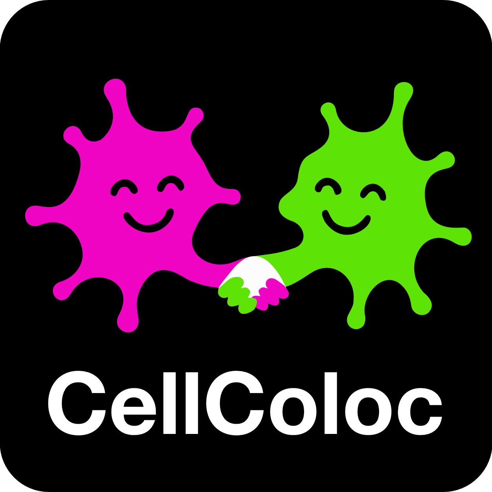

Overview
========

­

CellColoc is a Python package for interactive, segmentation-based
colocalization analysis in microscopy images.

The package is designed for workflows in which a user wants to:

- segment a larger biological object in one channel,
- segment or threshold a marker-defining structure in a second channel,
- classify cells as marker-positive or marker-negative based on overlap,
- optionally include a third channel for occupancy quantification or optional
  third-marker positivity,
- inspect, refine, and export results in a reproducible way.

The package supports both 2D and 3D data, flexible segmentation backends (we support both `Cellpose <https://www.cellpose.org>`_ and classical thresholding), and a range of optional features including optional ROI-based analysis, optional global z-cropping, optional z-projection, and fast post hoc Cellpose threshold refinement.

Motivation
----------

Many microscopy analysis scripts start as project-specific prototypes and then
grow by repeated copying and adaptation. This quickly leads to duplicated core
logic, inconsistent result formats, and hidden workflow drift across projects.

CellColoc addresses this by separating:

- reusable core analysis functions inside the package,
- project-specific configuration and execution logic inside interactive user
  scripts.

This keeps the analysis transparent and inspectable for researchers while still
making the underlying workflow reusable across datasets and projects.

Core design
-----------

CellColoc is built around a generic channel model:

- one primary ``cell`` channel,
- one primary ``marker`` channel,
- one optional third analysis channel.

Each analysis channel can use one of several segmentation backends:

- ``cellpose``
- ``otsu``
- ``li``
- ``percentile``

This means the package is not restricted to `Cellpose <https://www.cellpose.org>`_-only workflows. Neural
network segmentation and threshold-based segmentation can be combined on a
channel-by-channel basis.

Main features
-------------

CellColoc currently provides:

- OMIO-based microscopy loading
- automatic 2D versus 3D detection
- optional voxel-size resolution from OMIO metadata
- optional ROI drawing in napari
- optional whole-image analysis as a single ROI
- optional reuse of saved ROI masks
- ROI-wise segmentation and overlap analysis
- occupancy metrics for every segmented channel
- optional third-channel cell-positivity analysis
- optional global z-cropping
- optional global z-projection
- optional prefilter chains and postfilter chains
- fast `Cellpose <https://www.cellpose.org>`_ cache-based refinement
- optional manual mask editing followed by table recomputation
- standardized table and mask export into a ``results/`` folder

How do we define colocalization?
--------------------------------

CellColoc determines colocalization from segmented objects, not from raw
pixel-wise intensity correlation.

For one ROI :math:`R`, let

- :math:`C_i \subseteq R` be the voxel or pixel set of cell object :math:`i`
  in the primary ``cell`` channel,
- :math:`M_j \subseteq R` be the voxel or pixel set of marker object
  :math:`j` in the primary ``marker`` channel,
- :math:`M = \bigcup_j M_j` be the union of all marker-positive pixels or
  voxels in that ROI.

For each segmented cell object :math:`C_i`, CellColoc computes the overlap
with the marker segmentation as

.. math::

   O_i = \left| C_i \cap M \right|

where :math:`| \cdot |` denotes the number of pixels in 2D or voxels in 3D.

In addition, the overlap fraction of the cell object is computed as

.. math::

   f_i = \frac{\left| C_i \cap M \right|}{\left| C_i \right|}

A cell is classified as marker-positive when both of the following conditions
are fulfilled:

.. math::

   O_i \geq O_{\min}

and

.. math::

   f_i \geq \tau

where :math:`O_{\min}` is the minimum required overlap in pixels or voxels and
:math:`\tau` is the minimum required overlap fraction. In the package, these
two thresholds correspond to the configurable parameters
``min_overlap_voxels`` and ``overlap_fraction_threshold``.

This means that a cell is called positive only if the overlap is both
absolutely large enough and sufficiently large relative to the size of the
segmented cell object.

Occupancy metrics
-----------------

For every segmented channel, CellColoc also computes occupancy within each ROI.
If :math:`S \subseteq R` is the union of all positive pixels or voxels of one
segmented channel inside ROI :math:`R`, then the occupancy coverage is

.. math::

   \mathrm{coverage}(S, R) = \frac{|S|}{|R|} \times 100

reported as percent coverage.

For 3D data, CellColoc can report this in volumetric form. For projected data,
the same definition is applied to the analyzed 2D image.

Interactive workflow
--------------------

The intended usage model is interactive and notebook-like:

1. define dataset paths and channel assignments,
2. choose segmentation settings,
3. load the analysis channels,
4. optionally draw or reload ROIs,
5. run segmentation and colocalization,
6. inspect results in napari,
7. optionally refine thresholds or masks,
8. export the final results.

This makes CellColoc especially suitable for exploratory but still
reproducible microscopy workflows.

License
-------

CellColoc is distributed under the terms of the GNU General Public License v3.0
or later (GPL-3.0-or-later).

Citation
--------

If you use CellColoc in scientific work, please cite:

Musacchio, F. (2026). *CellColoc: A Python package for interactive
segmentation-based colocalization analysis in microscopy images*. Zenodo.
https://doi.org/10.5281/zenodo.20787509

.. raw:: html

   

For questions, suggestions or bug reports, please refer to the
`GitHub issue tracker <https://github.com/FabrizioMusacchio/cellcoloc/issues>`_ of 
the `CellColoc repository <https://github.com/FabrizioMusacchio/cellcoloc>`_ or contact the maintainer 
directly:

| **Fabrizio Musacchio**: `Email <mailto:fabrizio.musacchio@dzne.de>`_ | `GitHub <https://github.com/FabrizioMusacchio>`_ | `Website <https://www.fabriziomusacchio.com>`_
