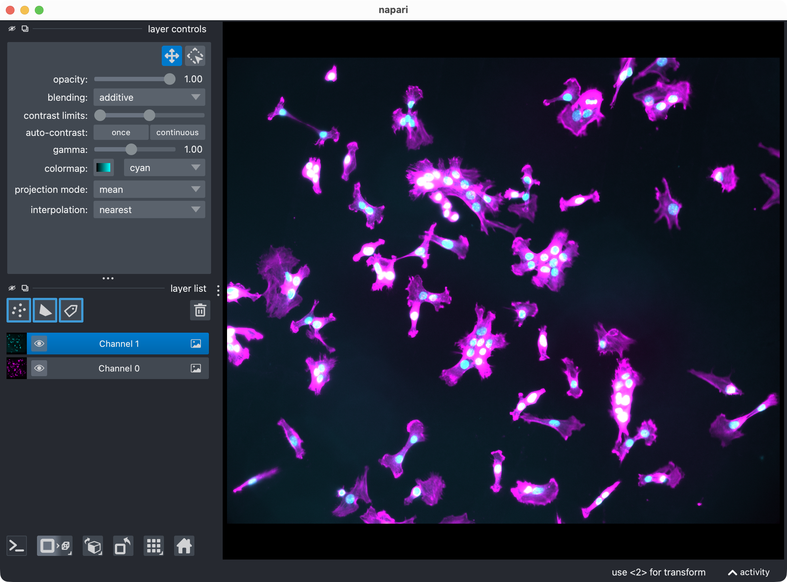
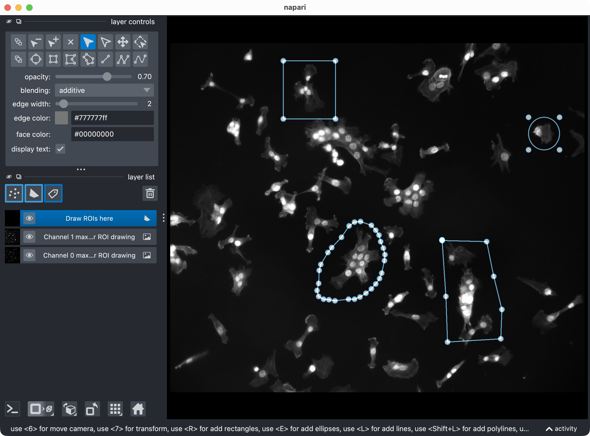
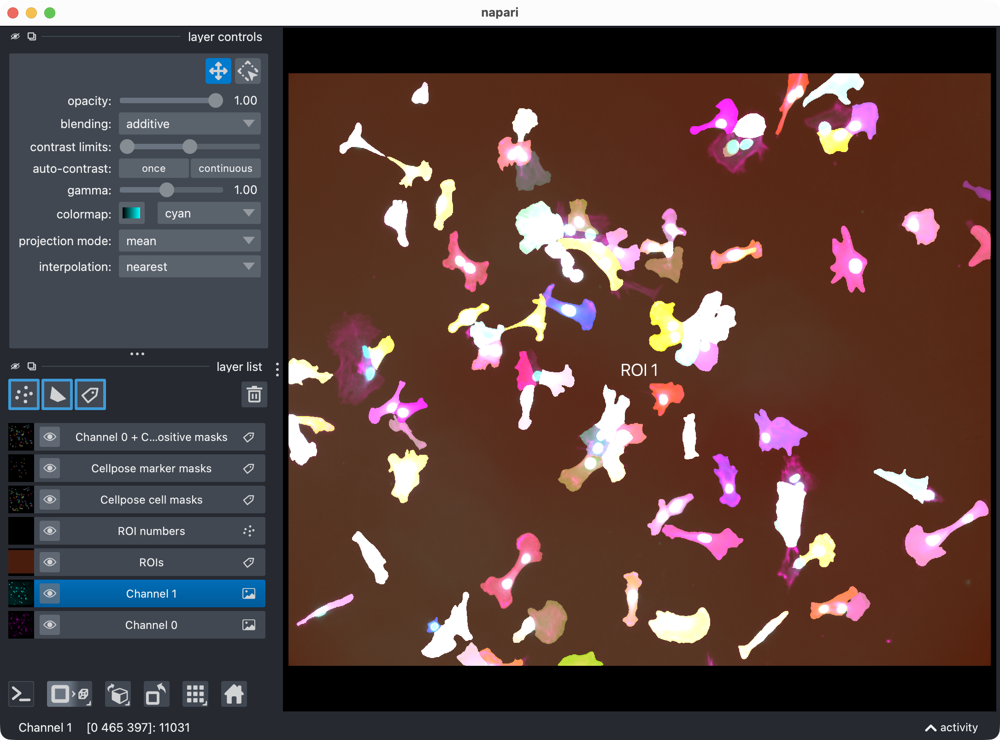
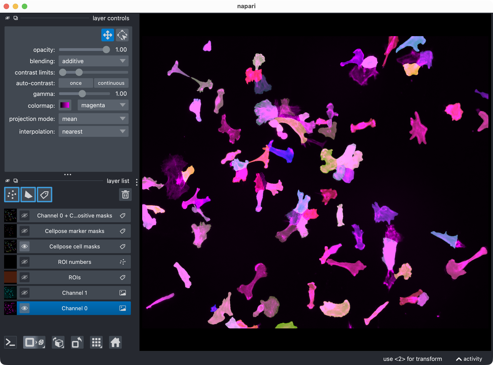
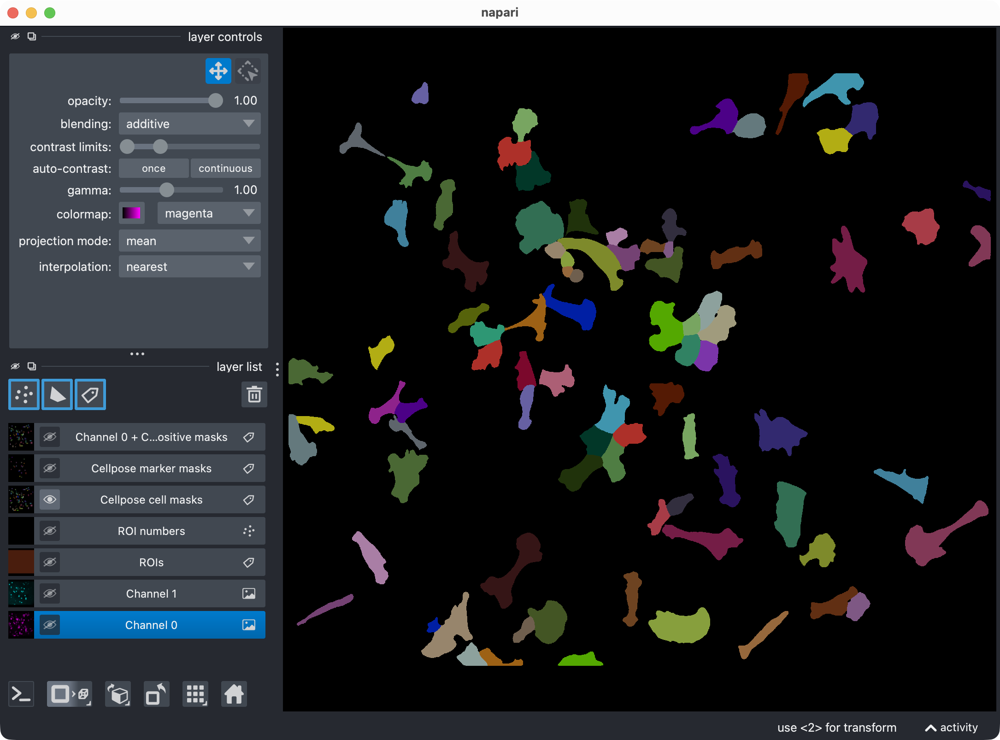
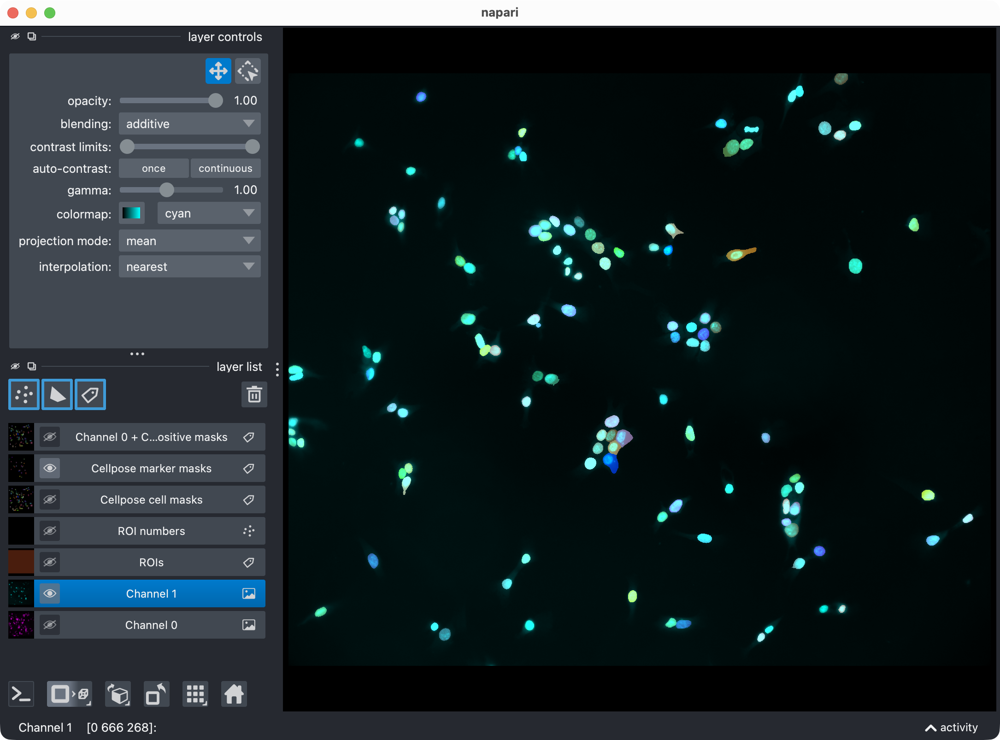
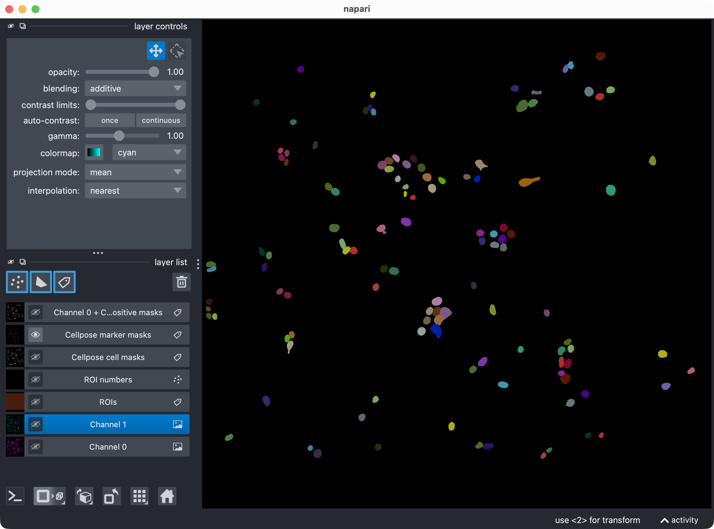
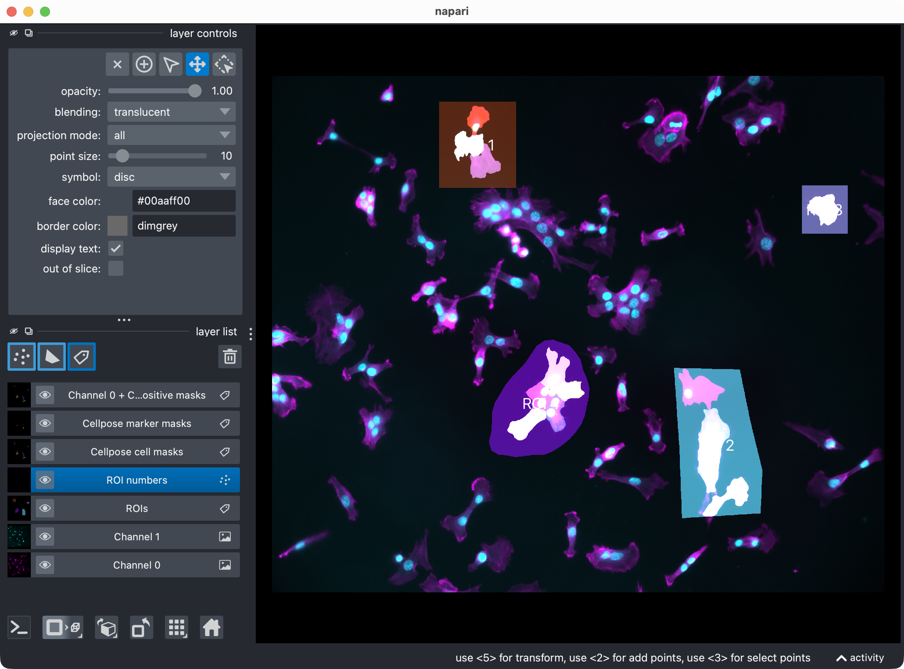
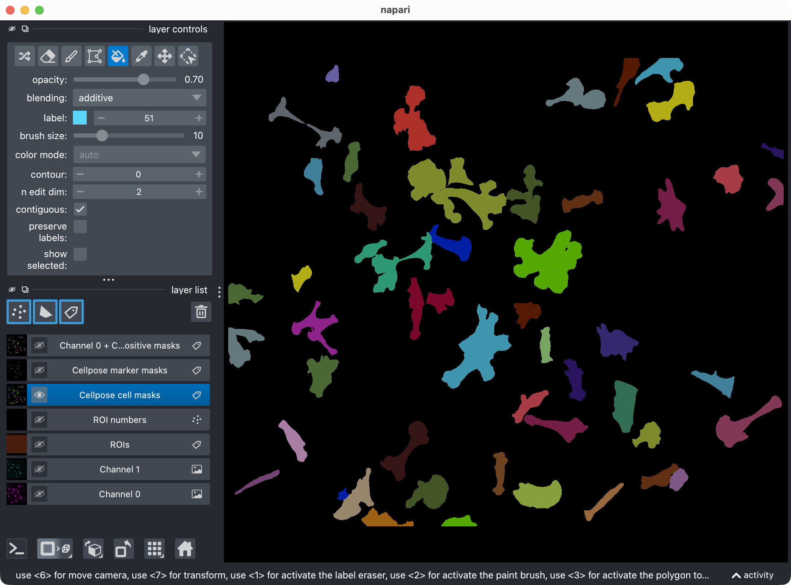

2D data analysis tutorial
=========================

This tutorial walks through a complete 2D CellColoc workflow based on the
interactive Jupyter notebook 

``user_scripts/dapi_stained_nuclei_2D_user_script.ipynb``,

which is identical to the interactive Python script 

``user_scripts/dapi_stained_nuclei_2D_user_script.py``, 

which you can use alternatively 
if you prefer the VS Code interactive window workflow.

The goal is to show how to analyze a two-channel 2D microscopy image from
scratch, how to configure CellColoc for whole-image analysis, and how to
optionally switch to ROI-based analysis when needed.

Dataset used in this tutorial
-----------------------------

The tutorial uses the example dataset ``dapi_stained_nuclei_2D.ome.tif`` of
DAPI-stained nuclei originally published by Raissa Rathar on 
`Zenodo <https://doi.org/10.5281/zenodo.1304211>`_.  This dataset is included in 
the CellColoc example data collection. Please download it from Zenodo 
as described in the `Example data set <usage_example_datasets.html>`_ section first if you want 
to follow along with the tutorial. Store the downloaded example dataset locally at a 
convenient location. For the remainder of this tutorial, we assume that you have 
placed it in a folder called ``example_data/`` relative to your 
current working directory/current example script: 

``example_data/dapi_stained_nuclei_2D/dapi_stained_nuclei_2D.ome.tif``

This is a true 2D OME-TIFF file with two channels. The file does not provide
reliable biological channel names in the OME metadata, so the channel meaning
is assigned explicitly in the script.

   The DAPI-stained nuclei example dataset shown in napari with the two channels.
 
In this tutorial, we treat:

- channel 0 as the primary ``cell`` channel,
- channel 1 as the primary ``marker`` channel.

The same structure can be reused for any other 2D two-channel dataset by
adapting the path, channel assignment, display names, and segmentation
settings.

How to use this tutorial
------------------------

The associated user-script 

``user_scripts/dapi_stained_nuclei_2D_user_script.ipynb`` 

is organized in cells, reflecting the structure of this tutorial. The same
accounts for the alternative Python script 

``user_scripts/dapi_stained_nuclei_2D_user_script.py``.

The recommended way to follow this tutorial is:

1. open ``user_scripts/dapi_stained_nuclei_2D_user_script.ipynb`` or ``user_scripts/dapi_stained_nuclei_2D_user_script.py``,
2. run the cells from top to bottom,
3. adjust only the configuration values that are relevant for your own data.

The subsections below follow the same order as the script cells.

Imports and package bootstrap
-----------------------------

The first cell imports the public CellColoc API, napari, and NumPy:

.. literalinclude:: ../../user_scripts/dapi_stained_nuclei_2D_user_script.py
   :language: python
   :start-after: # %% IMPORTS AND LOCAL PACKAGE BOOTSTRAP
   :end-before: # %% PROJECT SETTINGS

What this cell does:

- locates the repository root via ``PROJECT_ROOT``,
- imports the configuration dataclasses and helper functions from
  ``cellcoloc``,
- imports napari for ROI drawing and result inspection.

Project settings
----------------

The next cell contains the complete analysis configuration:

.. literalinclude:: ../../user_scripts/dapi_stained_nuclei_2D_user_script.py
   :language: python
   :start-after: # %% PROJECT SETTINGS
   :end-before: # %% LOAD THE ANALYSIS CHANNELS

This is the most important cell for adapting the tutorial to your own data.

Data path
~~~~~~~~~

``DATA_PATH`` points to the microscopy file that should be analyzed.

Replace this with your own OME-TIFF, CZI, or other `OMIO <https://omio.readthedocs.io/en/latest/>`_-readable dataset when
you adapt the workflow.

Channel assignment
~~~~~~~~~~~~~~~~~~

``CHANNEL_CONFIG`` defines which raw channels are interpreted as:

- ``cell_channel``: the segmented primary objects,
- ``marker_channel``: the segmented marker channel used for positivity,
- ``optional_region_channel``: an optional third channel.

For this tutorial, the third channel is disabled:

.. code-block:: python

   optional_region_channel=None

CellColoc can analyze up to three channels in total. The third channel is optional and 
not needed for a basic colocalization analysis. You can enable it for additional occupancy 
quantification or an optional third marker positivity call if your data supports that.

Display names
~~~~~~~~~~~~~

``DISPLAY_NAMES`` controls the human-readable labels used in napari and
exported result layers.

You should set these names to biologically meaningful labels for your own
project, for example ``"DAPI nuclei"``, ``"Iba1"``, or ``"Tumor mask"``.

Voxel scale
~~~~~~~~~~~

``VOXEL_SCALE_ZYX`` defines the physical size of voxels or pixels as
``(z, y, x)``.

For true 2D data, the ``z`` value is still present but usually acts only as a
placeholder because there is only one z-plane.

You can:

- set this explicitly, as done in the tutorial,
- or set it to ``None`` and let CellColoc try to resolve it from `OMIO <https://omio.readthedocs.io/en/latest/>`_ metadata.
  metadata.

Cell segmentation and marker segmentation
~~~~~~~~~~~~~~~~~~~~~~~~~~~~~~~~~~~~~~~~~

``CELL_MODEL_CONFIG`` and ``MARKER_MODEL_CONFIG`` define how each channel is
segmented.

In this tutorial both channels use Cellpose:

.. code-block:: python

   segmentation_method="cellpose"

Key options in these configs include:

- ``model_name_or_path``:
  built-in model name such as ``"cpsam"`` or a custom model path.
- ``segmentation_method``:
  one of ``"cellpose"``, ``"otsu"``, ``"li"``, or ``"percentile"``.
- ``diameter``:
  optional object diameter for Cellpose. ``None`` lets newer Cellpose
  versions infer the scale automatically.
- ``cellprob_threshold``:
  adjusts how permissive Cellpose is regarding the cell-probability map.
- ``flow_threshold``:
  adjusts how strict Cellpose is when filtering masks by flow consistency.
- ``prefilter``:
  optional image prefiltering before segmentation.
- ``postfilters``:
  optional mask cleanup after segmentation.

If you do not want Cellpose for one channel, you can switch that channel to a
threshold-based backend, for example:

.. code-block:: python

   segmentation_method="otsu"

Colocalization settings
~~~~~~~~~~~~~~~~~~~~~~~

``COLOCALIZATION_CONFIG`` controls how overlap is converted into a positive or
negative cell call.

The most relevant parameters are:

- ``min_cell_voxels``:
  discard segmented cell objects smaller than this size.
- ``min_overlap_voxels``:
  require at least this many overlapping pixels.
- ``overlap_fraction_threshold``:
  require the overlap to cover at least this fraction of the cell mask.

Together, these thresholds define the object-based positivity rule described in
the overview section of the documentation.

Runtime settings
~~~~~~~~~~~~~~~~

``RUNTIME_CONFIG`` controls runtime behavior rather than segmentation logic.

Important options are:

- ``draw_rois``:
  whether napari-based ROI drawing is enabled.
- ``open_results``:
  whether result visualization is shown in napari.
- ``use_gpu``:
  whether Cellpose should try to use a GPU.
- ``crop_for_testing``:
  optional temporary crop for debugging or fast prototyping.

Whole-image versus ROI mode
~~~~~~~~~~~~~~~~~~~~~~~~~~~

Two additional switches control whether the full 2D image is analyzed directly
or whether custom ROIs are used:

- ``USE_FULL_IMAGE_AS_SINGLE_ROI = True``
- ``REUSE_EXISTING_ROI_MASK_IF_AVAILABLE = True``

For this tutorial, the default idea is to analyze the whole 2D image as one
single ROI. That is why ``USE_FULL_IMAGE_AS_SINGLE_ROI`` is set to ``True``.

If you prefer ROI-based analysis instead:

- set ``USE_FULL_IMAGE_AS_SINGLE_ROI = False``,
- keep ``RUNTIME_CONFIG.draw_rois = True`` to draw new ROIs,
- or keep ``REUSE_EXISTING_ROI_MASK_IF_AVAILABLE = True`` to reuse a saved ROI
  mask from a previous run.

Load the analysis channels
--------------------------

The next cell loads the configured channels from disk:

.. literalinclude:: ../../user_scripts/dapi_stained_nuclei_2D_user_script.py
   :language: python
   :start-after: # %% LOAD THE ANALYSIS CHANNELS
   :end-before: # %% DRAW ROIS INTERACTIVELY IN NAPARI

This step:

- reads the microscopy file through `OMIO <https://omio.readthedocs.io/en/latest/>`_,
- extracts the configured analysis channels,
- resolves voxel size,
- creates standardized output paths inside the dataset's ``results/``
  directory.

After running the cell, the script prints the results folder that will receive
mask exports and tabular outputs.

Optional: Draw ROIs interactively in napari
-------------------------------------------

The next cell only becomes relevant when you disable whole-image mode:

.. literalinclude:: ../../user_scripts/dapi_stained_nuclei_2D_user_script.py
   :language: python
   :start-after: # %% DRAW ROIS INTERACTIVELY IN NAPARI
   :end-before: # %% SAVE THE DRAWN ROIS OR LOAD AN EXISTING ROI MASK

   If activated, this is how the ROI drawing step looks in napari. You can draw one or more ROIs with the shapes layer, and then execute the next cell to save the ROIs as a label image for the analysis.

The logic is:

- if ``USE_FULL_IMAGE_AS_SINGLE_ROI`` is ``True``, ROI drawing is skipped,
- else, if ``REUSE_EXISTING_ROI_MASK_IF_AVAILABLE`` is ``True``, CellColoc
  first looks for a previously saved ROI label mask in the results directory,
- if such a saved ROI mask exists, it is reused and drawing is skipped,
- if not, napari opens and you can draw one or more ROIs interactively.

This is useful in two common situations:

- first analysis run:
  you draw the ROIs once,
- later rerun of the same dataset:
  you reuse the saved ROI mask instead of drawing again.

If you want forced redraw behavior every time, set:

.. code-block:: python

   REUSE_EXISTING_ROI_MASK_IF_AVAILABLE = False

Optional: Save drawn ROIs or load an existing ROI mask
------------------------------------------------------

The following cell resolves the final ROI mask that will be used for analysis:

.. literalinclude:: ../../user_scripts/dapi_stained_nuclei_2D_user_script.py
   :language: python
   :start-after: # %% SAVE THE DRAWN ROIS OR LOAD AN EXISTING ROI MASK
   :end-before: # %% RUN THE ROI-WISE CELLPOSE COLOCALIZATION

This cell supports three modes:

Whole-image mode
~~~~~~~~~~~~~~~~

If ``USE_FULL_IMAGE_AS_SINGLE_ROI`` is ``True``, CellColoc creates one ROI
that spans the complete image.

This is the simplest entry point for 2D analysis and the default assumption in
this tutorial.

Interactive ROI mode
~~~~~~~~~~~~~~~~~~~~

If whole-image mode is disabled and you drew ROIs in napari, the shapes are
rasterized into a label image and saved to the results directory.

Saved ROI reuse mode
~~~~~~~~~~~~~~~~~~~~

If a saved ROI mask was found earlier, that existing label image is loaded and
used directly.

After this step, ``roi_labels_2d`` contains the actual ROI label map for the
analysis, and the script prints the detected ROI IDs.

Run the ROI-wise segmentation and colocalization analysis
---------------------------------------------------------

This is the main analysis step:

.. literalinclude:: ../../user_scripts/dapi_stained_nuclei_2D_user_script.py
   :language: python
   :start-after: # %% RUN THE ROI-WISE CELLPOSE COLOCALIZATION
   :end-before: # %% VISUALIZE THE RESULT IN NAPARI

What happens here:

- each ROI is processed separately,
- the ``cell`` channel is segmented according to ``CELL_MODEL_CONFIG``,
- the ``marker`` channel is segmented according to ``MARKER_MODEL_CONFIG``,
- overlap between both segmentation results is measured,
- positive and negative cells are classified,
- detailed, summary, and overview tables are assembled.

The function returns a ``run_result`` object that contains:

- the full label masks,
- ROI-level and cell-level tables,
- optional Cellpose refinement cache data.

For threshold-based methods this same function would still be used. Only the
channel configs would change.

Depending on the size of the image, the number of ROIs, and your computational 
resources, this step can take a while. If you want to test the workflow on a smaller 
crop of the image, set:

.. code-block:: python

   RUNTIME_CONFIG.crop_for_testing = (slice(0, 1), slice(0, 512), slice(0, 512))

Visualize the result in napari
------------------------------

The next cell opens the current result in napari:

.. literalinclude:: ../../user_scripts/dapi_stained_nuclei_2D_user_script.py
   :language: python
   :start-after: # %% VISUALIZE THE RESULT IN NAPARI
   :end-before: # %% OPTIONALLY REFINE RESULTS AND VISUALIZE UPDATED RESULT IN NAPARI

   The napari viewer showing the analysis result layers, including the original channels, ROI labels, segmented cell masks, segmented marker masks, and positive-cell mask.

This visualization usually includes:

- the analysis channels,
- the ROI labels,
- the segmented cell masks,
- the segmented marker masks,
- the derived positive-cell mask.

This is the first checkpoint where you inspect whether the segmentation and
positivity calls look plausible before refining anything.

   Top: Segmentation result for channel 0 (cell channel) shown in napari together with the original image for reference. Bottom: Segmentation result for channel 0 only, showing the segmented cell masks.

   
   Top: Segmentation result for channel 1 (marker channel) shown in napari together with the original image for reference. Bottom: Segmentation result for channel 1 only, showing the segmented marker masks.

   
   In case you have analyzed individual ROIs instead of the whole image, this is how the ROI labels look in napari. Each ROI is assigned a different integer ID, which enables ROI-wise analysis and result aggregation.

If you want to skip napari output during batch-style testing, set:

.. code-block:: python

   RUNTIME_CONFIG.open_results = False

Optional: Refine Cellpose thresholds and inspect the updated result
-------------------------------------------------------------------

The next cell performs cache-based post hoc refinement:

.. literalinclude:: ../../user_scripts/dapi_stained_nuclei_2D_user_script.py
   :language: python
   :start-after: # %% OPTIONALLY REFINE RESULTS AND VISUALIZE UPDATED RESULT IN NAPARI
   :end-before: # %% OPTIONALLY REANALYZE MANUALLY EDITED LABEL LAYERS FROM NAPARI

This step is useful when the initial Cellpose result is close to correct but
slightly too permissive or too conservative.

The refinement works by rebuilding masks from **cached** Cellpose network outputs
instead of rerunning the full network forward pass. This is much faster than
running a fresh Cellpose segmentation from scratch.

Relevant refinement settings include:

- ``REFINE_WITH_CACHED_CELLPOSE_OUTPUTS``:
  enable or disable the refinement step.
- ``REFINED_CELL_CELLPROB_THRESHOLD`` and
  ``REFINED_CELL_FLOW_THRESHOLD``:
  new thresholds for the cell channel.
- ``REFINED_MARKER_CELLPROB_THRESHOLD`` and
  ``REFINED_MARKER_FLOW_THRESHOLD``:
  new thresholds for the marker channel.

If you only want to refine one channel, you can keep the other channel's
thresholds unchanged.

Optional: Reanalyze manually edited label layers from napari
------------------------------------------------------------

The next cell supports a more manual correction workflow:

.. literalinclude:: ../../user_scripts/dapi_stained_nuclei_2D_user_script.py
   :language: python
   :start-after: # %% OPTIONALLY REANALYZE MANUALLY EDITED LABEL LAYERS FROM NAPARI
   :end-before: # %% EXPORT RESULTS

   
   Manually edited label layers in napari. In this example, the user has manually edited the marker mask layer to correct a segmentation error. After running the current cell, the updated masks will be reanalyzed and the results will be updated accordingly.

This is useful when:

- Cellpose split one object into several labels,
- Cellpose missed a merge or introduced a false positive,
- you want to manually correct the label layers directly in napari.

The workflow is:

1. inspect the result in napari,
2. edit the label layers manually,
3. run this cell,
4. let CellColoc recompute the tables from the updated masks.

The underlying image data are not resegmented here. Instead, the edited mask
layers are read back from napari and analyzed as the new truth for this run.

Export results
--------------

The final cell writes the outputs to disk:

.. literalinclude:: ../../user_scripts/dapi_stained_nuclei_2D_user_script.py
   :language: python
   :start-after: # %% EXPORT RESULTS
   :end-before: # %% END

The exported results are written to the dataset's ``results/`` directory.

Typical outputs include:

- ROI mask,
- cell mask,
- marker mask,
- positive-cell mask,
- detailed CSV tables,
- a combined Excel workbook with the overview, summary, and detailed tables.

The export is intentionally placed at the end of the interactive workflow so
that the saved outputs reflect the final accepted analysis state rather than an
early intermediate result.

Adapting this tutorial to your own data
---------------------------------------

To reuse this workflow for your own 2D microscopy project, the most important
places to adapt are:

- ``DATA_PATH``
- ``CHANNEL_CONFIG``
- ``DISPLAY_NAMES``
- ``VOXEL_SCALE_ZYX`` or automatic metadata-based scaling
- ``CELL_MODEL_CONFIG``
- ``MARKER_MODEL_CONFIG``
- ``COLOCALIZATION_CONFIG``
- ``USE_FULL_IMAGE_AS_SINGLE_ROI`` and
  ``REUSE_EXISTING_ROI_MASK_IF_AVAILABLE``

For a first pass on a new 2D dataset, a very practical strategy is:

1. start with whole-image mode,
2. verify that the segmentation backend and thresholds are reasonable,
3. switch to ROI mode only if you need spatial restriction,
4. use cache-based refinement for final tuning,
5. export only after the result looks correct in napari.
