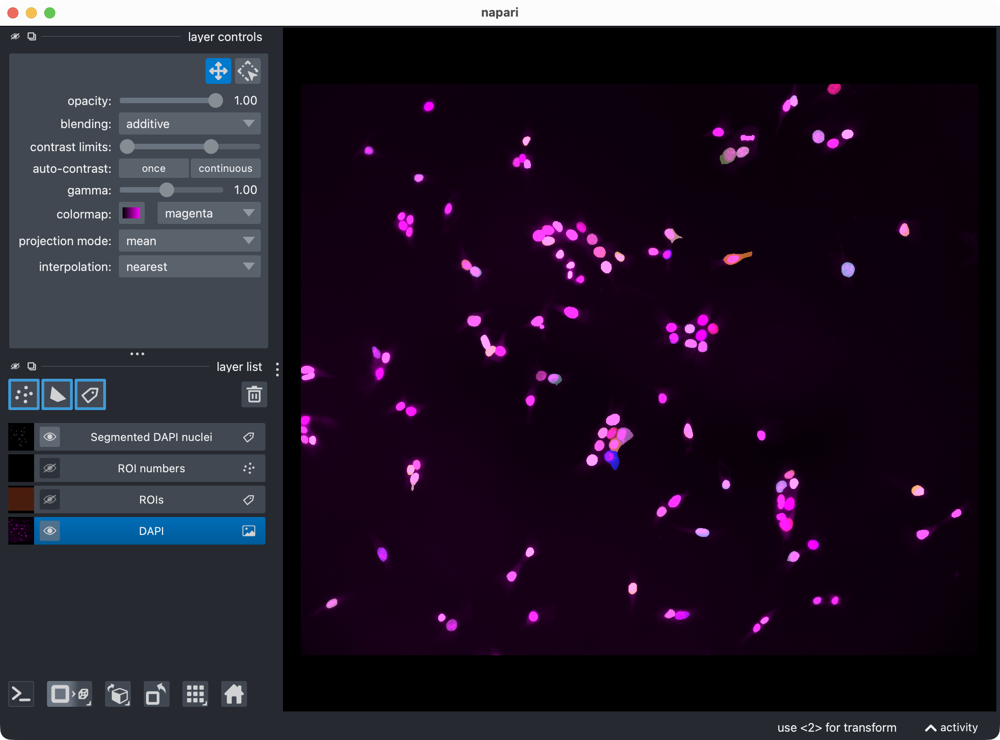
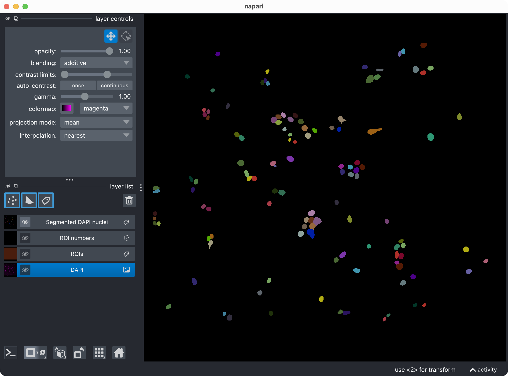

Single-channel analysis tutorial
==========================================

This tutorial walks through a complete 2D single-channel CellColoc workflow
based on the interactive Jupyter notebook

``user_scripts/dapi_stained_nuclei_2D_single_channel_user_script.ipynb``,

which is identical to the interactive Python script

``user_scripts/dapi_stained_nuclei_2D_single_channel_user_script.py``,

which you can use alternatively if you prefer the VS Code interactive window
workflow.

The goal is to show how to analyze a one-channel 2D microscopy image from
scratch when no colocalization step is needed and the main biological question
is simply: *how many segmented objects are present, how large are they, and
what is their morphology?*

This tutorial uses the single-channel CellColoc workflow, which reuses the
same segmentation backends and interactive mechanics as the multi-channel
pipeline, but skips all marker-overlap logic.

Dataset used in this tutorial
-----------------------------

The tutorial uses the example dataset ``dapi_stained_nuclei_2D.ome.tif`` of
DAPI-stained nuclei originally published by Raissa Rathar on
`Zenodo <https://doi.org/10.5281/zenodo.1304211>`_. This dataset is included
in the CellColoc example data collection. Please download it from Zenodo as
described in the `Example data set <usage_example_datasets.html>`_ section
first if you want to follow along with the tutorial. Store the downloaded
example dataset locally at a convenient location. For the remainder of this
tutorial, we assume that you have placed it in a folder called
``example_data/`` relative to your current working directory/current example
script:

``example_data/dapi_stained_nuclei_2D/dapi_stained_nuclei_2D.ome.tif``

This is a true 2D OME-TIFF file with two channels. In this tutorial, we do
*not* use both channels for a colocalization analysis. Instead, we deliberately
pick just one channel and count its segmented nuclei-like objects.

.. figure:: _static/dapi_stained_nuclei_2D_01.png
   :alt: The DAPI-stained nuclei example dataset shown in napari with the two channels.
   :align: center
   :figwidth: 100%

   The DAPI-stained nuclei example dataset shown in napari with the two raw
   channels.

In this tutorial, the single-channel workflow is configured so that:

- ``channel_index=1`` is loaded and segmented,
- the segmented objects are interpreted as DAPI-stained nuclei,
- no second marker channel is used.

The same structure can be reused for any other one-channel or one-target use
case, for example:

- counting nuclei in one DAPI channel,
- segmenting one soma channel only,
- counting puncta or aggregates in a single fluorescence channel,
- measuring ROI-wise occupancy of one segmented structure.

How to use this tutorial
------------------------

The associated user-script

``user_scripts/dapi_stained_nuclei_2D_single_channel_user_script.ipynb``

is organized in cells, reflecting the structure of this tutorial. The same
applies to the alternative Python script (there: ``# %%`` cells)

``user_scripts/dapi_stained_nuclei_2D_single_channel_user_script.py``.

The recommended way to follow this tutorial is:

1. open
   ``user_scripts/dapi_stained_nuclei_2D_single_channel_user_script.ipynb`` or
   ``user_scripts/dapi_stained_nuclei_2D_single_channel_user_script.py``,
2. run the cells from top to bottom,
3. adjust only the configuration values that are relevant for your own data.

The subsections below follow the same order as the script cells.

Imports
-------

The first cell imports the public single-channel CellColoc API, napari, NumPy,
and ``dataclasses.replace``:

.. literalinclude:: ../../user_scripts/dapi_stained_nuclei_2D_single_channel_user_script.py
   :language: python
   :start-after: # %% IMPORTS
   :end-before: # %% PROJECT SETTINGS

What this cell does:

- locates the repository root via ``PROJECT_ROOT``,
- imports the single-channel configuration dataclasses and helper functions,
- imports napari for ROI drawing and result inspection,
- imports ``replace`` so that temporary refinement configs can be derived from
  the base segmentation config without overwriting it.

Project settings
----------------

The next cell contains the complete single-channel analysis configuration:

.. literalinclude:: ../../user_scripts/dapi_stained_nuclei_2D_single_channel_user_script.py
   :language: python
   :start-after: # %% PROJECT SETTINGS
   :end-before: # %% LOAD THE ANALYSIS CHANNEL

This is the most important cell for adapting the tutorial to your own data.

Data path
~~~~~~~~~

``DATA_PATH`` points to the microscopy file that should be analyzed.

Replace this with your own OME-TIFF, CZI, or other
`OMIO <https://omio.readthedocs.io/en/latest/>`_-readable dataset when you
adapt the workflow.

Single-channel assignment
~~~~~~~~~~~~~~~~~~~~~~~~~

``CHANNEL_CONFIG`` is now a ``SingleChannelConfig`` instead of the usual
two-channel ``ChannelConfig``.

The key setting is:

.. code-block:: python

   channel_index=1

This means: load only the raw channel at index 1 and pass it into the
single-channel segmentation workflow.

Display names
~~~~~~~~~~~~~

``DISPLAY_NAMES`` is now a ``SingleChannelDisplayNames`` config. It controls:

- the name of the image layer in napari,
- the name of the segmentation label layer.

For your own projects, choose biologically meaningful names such as
``"DAPI"``, ``"Nuclei"``, ``"Neuronal somata"``, or ``"Aggregates"``.

Voxel scale
~~~~~~~~~~~

``VOXEL_SCALE_ZYX`` defines the physical size of voxels or pixels as
``(z, y, x)``. For true 2D data, CellColoc also accepts a shorter
``(y, x)`` tuple, which is exactly what is used here:

.. code-block:: python

   VOXEL_SCALE_ZYX = (0.325, 0.325)

Internally, this is expanded to ``(1.0, 0.325, 0.325)``.

You can also set this to ``None`` and let CellColoc try to resolve it from
OMIO metadata.

Segmentation config
~~~~~~~~~~~~~~~~~~~

``MODEL_CONFIG`` contains the segmentation settings for the single analyzed
channel.

In this tutorial, the single channel uses Cellpose:

.. code-block:: python

   segmentation_method="cellpose"

Important options are the same as in the multi-channel workflow:

- ``model_name_or_path``:
  built-in model name such as ``"cpsam"`` or a custom model path.
- ``segmentation_method``:
  one of ``"cellpose"``, ``"otsu"``, ``"li"``, or ``"percentile"``.
- ``diameter``:
  optional object diameter for Cellpose. ``None`` lets newer Cellpose infer
  the scale automatically.
- ``cellprob_threshold`` and ``flow_threshold``:
  Cellpose threshold parameters.
- ``prefilter``:
  optional image prefiltering before segmentation.
- ``postfilters``:
  optional mask cleanup after segmentation.
- ``z_crop`` and ``z_projection``:
  available here as well, even though this particular tutorial uses a true 2D
  dataset.

If you prefer a threshold-based workflow, you can switch to:

.. code-block:: python

   segmentation_method="otsu"

or one of the other supported non-Cellpose backends.

Analysis config
~~~~~~~~~~~~~~~

``ANALYSIS_CONFIG`` is a ``SingleChannelAnalysisConfig``.

For now, its key parameter is:

- ``min_object_voxels``:
  discard segmented objects smaller than this size before counting and table
  generation.

Runtime settings
~~~~~~~~~~~~~~~~

``RUNTIME_CONFIG`` controls runtime behavior rather than segmentation logic.

Important options are:

- ``draw_rois``:
  whether napari-based ROI drawing is enabled.
- ``open_results``:
  whether result visualization is shown in napari.
- ``use_gpu``:
  whether Cellpose should try to use a GPU.
- ``crop_for_testing``:
  optional temporary crop for debugging or fast prototyping.
- ``image_loading_mode``:
  ``"memory"`` or ``"memap"``.

Whole-image versus ROI mode
~~~~~~~~~~~~~~~~~~~~~~~~~~~

Two additional switches control whether the full 2D image is analyzed directly
or whether custom ROIs are used:

- ``USE_FULL_IMAGE_AS_SINGLE_ROI = True``
- ``REUSE_EXISTING_ROI_MASK_IF_AVAILABLE = True``

For this tutorial, the default assumption is whole-image analysis.

If you prefer ROI-based analysis instead:

- set ``USE_FULL_IMAGE_AS_SINGLE_ROI = False``,
- keep ``RUNTIME_CONFIG.draw_rois = True`` to draw new ROIs,
- or keep ``REUSE_EXISTING_ROI_MASK_IF_AVAILABLE = True`` to reuse a saved ROI
  mask from a previous run.

Load the analysis channel
-------------------------

The next cell loads the configured analysis channel from disk:

.. literalinclude:: ../../user_scripts/dapi_stained_nuclei_2D_single_channel_user_script.py
   :language: python
   :start-after: # %% LOAD THE ANALYSIS CHANNEL
   :end-before: # %% DRAW ROIS INTERACTIVELY IN NAPARI

This step:

- reads the microscopy file through OMIO,
- extracts the configured analysis channel only,
- resolves voxel size,
- creates standardized output paths inside the dataset's ``results/``
  directory,
- optionally prepares the image for z projection if that feature is enabled.

Because this tutorial uses a plain 2D dataset, the loaded analysis view stays
2D throughout.

Optional: Draw ROIs interactively in napari
-------------------------------------------

The next cell only becomes relevant when you disable whole-image mode:

.. literalinclude:: ../../user_scripts/dapi_stained_nuclei_2D_single_channel_user_script.py
   :language: python
   :start-after: # %% DRAW ROIS INTERACTIVELY IN NAPARI
   :end-before: # %% SAVE THE DRAWN ROIS OR LOAD AN EXISTING ROI MASK

The logic is:

- if ``USE_FULL_IMAGE_AS_SINGLE_ROI`` is ``True``, ROI drawing is skipped,
- else, if ``REUSE_EXISTING_ROI_MASK_IF_AVAILABLE`` is ``True``, CellColoc
  first looks for a previously saved ROI label mask in the results directory,
- if such a saved ROI mask exists, it is reused and drawing is skipped,
- if not, napari opens and you can draw one or more ROIs interactively.

This is the same ROI logic used in the multi-channel scripts, just applied to
the single analyzed channel.

Optional: Save drawn ROIs or load an existing ROI mask
------------------------------------------------------

The following cell resolves the final ROI mask that will be used for analysis:

.. literalinclude:: ../../user_scripts/dapi_stained_nuclei_2D_single_channel_user_script.py
   :language: python
   :start-after: # %% SAVE THE DRAWN ROIS OR LOAD AN EXISTING ROI MASK
   :end-before: # %% RUN THE ROI-WISE SINGLE-CHANNEL SEGMENTATION AND COUNTING

This cell supports three modes:

Whole-image mode
~~~~~~~~~~~~~~~~

If ``USE_FULL_IMAGE_AS_SINGLE_ROI`` is ``True``, CellColoc creates one ROI
that spans the complete image.

Interactive ROI mode
~~~~~~~~~~~~~~~~~~~~

If whole-image mode is disabled and you drew ROIs in napari, the shapes are
rasterized into a label image and saved to the results directory.

Saved ROI reuse mode
~~~~~~~~~~~~~~~~~~~~

If a saved ROI mask was found earlier, that existing label image is loaded and
used directly.

After this step, ``roi_labels_2d`` contains the actual ROI label map for the
analysis, and the script prints the detected ROI IDs.

Run the ROI-wise single-channel segmentation and counting
---------------------------------------------------------

This is the main analysis step:

.. literalinclude:: ../../user_scripts/dapi_stained_nuclei_2D_single_channel_user_script.py
   :language: python
   :start-after: # %% RUN THE ROI-WISE SINGLE-CHANNEL SEGMENTATION AND COUNTING
   :end-before: # %% VISUALIZE THE RESULT IN NAPARI

What happens here:

- each ROI is processed separately,
- the single analysis channel is segmented according to ``MODEL_CONFIG``,
- small objects are filtered according to ``ANALYSIS_CONFIG``,
- object-wise and ROI-wise result tables are assembled.

The function returns a ``run_result`` object that contains:

- the full label mask,
- per-object and per-ROI tables,
- optional Cellpose refinement cache data.

Depending on the image size, ROI count, and available hardware, this step can
take some time. For quick testing, you can use:

.. code-block:: python

   RUNTIME_CONFIG.crop_for_testing = (slice(0, 1), slice(0, 512), slice(0, 512))

Visualize the result in napari
------------------------------

The next cell opens the current result in napari:

.. literalinclude:: ../../user_scripts/dapi_stained_nuclei_2D_single_channel_user_script.py
   :language: python
   :start-after: # %% VISUALIZE THE RESULT IN NAPARI
   :end-before: # %% OPTIONALLY REFINE RESULTS AND VISUALIZE UPDATED RESULT IN NAPARI

   
   Segmentation result of the single-channel workflow, showing the DAPI-stained nuclei and the resulting segmentation layer of the nuclei (top) and the segmentation layer only (bottom). 

This visualization usually includes:

- the analysis channel,
- the ROI labels,
- the segmented object masks.

This is the first checkpoint where you inspect whether the segmentation looks
plausible before refining anything.

If you want to skip napari output during batch-style testing, set:

.. code-block:: python

   RUNTIME_CONFIG.open_results = False

Optional: Refine Cellpose thresholds and inspect the updated result
-------------------------------------------------------------------

The next cell performs cache-based post hoc refinement:

.. literalinclude:: ../../user_scripts/dapi_stained_nuclei_2D_single_channel_user_script.py
   :language: python
   :start-after: # %% OPTIONALLY REFINE RESULTS AND VISUALIZE UPDATED RESULT IN NAPARI
   :end-before: # %% OPTIONALLY REANALYZE MANUALLY EDITED LABEL LAYERS FROM NAPARI

This step is useful when the initial Cellpose result is close to correct but
slightly too permissive or too conservative.

The refinement works by rebuilding masks from **cached** Cellpose network
outputs instead of rerunning the full network forward pass. This is much
faster than launching a fresh segmentation from scratch.

Relevant refinement settings include:

- ``REFINE_WITH_CACHED_CELLPOSE_OUTPUTS``:
  enable or disable the refinement step.
- ``REFINED_CELLPROB_THRESHOLD``:
  new Cellpose probability threshold for the single analyzed channel.
- ``REFINED_FLOW_THRESHOLD``:
  new Cellpose flow threshold.
- ``REFINED_POSTFILTERS``:
  optional post hoc filters such as ``"min_intensity"``,
  ``"local_contrast"``, or ``"bright_pixel_support"``.

Optional: Reanalyze manually edited label layers from napari
------------------------------------------------------------

The next cell supports a manual correction workflow:

.. literalinclude:: ../../user_scripts/dapi_stained_nuclei_2D_single_channel_user_script.py
   :language: python
   :start-after: # %% OPTIONALLY REANALYZE MANUALLY EDITED LABEL LAYERS FROM NAPARI
   :end-before: # %% EXPORT RESULTS

This is useful when:

- Cellpose split one object into several labels,
- Cellpose merged neighboring objects incorrectly,
- you want to remove or redraw objects directly in napari.

The workflow is:

1. inspect the result in napari,
2. edit the label layer manually,
3. run this cell,
4. let CellColoc recompute the tables from the updated mask layer.

The underlying image is not resegmented here. Instead, the edited label layer
is read back from napari and analyzed as the new truth for this run.

Export results
--------------

The final cell exports the result tables and masks:

.. literalinclude:: ../../user_scripts/dapi_stained_nuclei_2D_single_channel_user_script.py
   :language: python
   :start-after: # %% EXPORT RESULTS
   :end-before: # %% END

This writes the single-channel outputs to the dataset's ``results/``
directory.

The Excel workbook produced by the single-channel workflow contains three
sheets:

- ``object_summary``
- ``voxel_plausibility_check``
- ``roi_overview``

Result table: object_summary
----------------------------

This is the main biologically relevant per-object table. It contains one row
per segmented object.

Identity and location columns
~~~~~~~~~~~~~~~~~~~~~~~~~~~~~

``roi_id``
   ID of the ROI containing the object.

``object_label``
   Integer label of the object in the exported segmentation mask.

``centroid_z``, ``centroid_y``, ``centroid_x``
   Coordinates of the object centroid. For true 2D data, ``centroid_z`` is
   typically ``0.0`` because CellColoc internally represents 2D images as a
   singleton-z volume ``(1, Y, X)``.

2D morphology columns
~~~~~~~~~~~~~~~~~~~~~

For 2D or z-projected analyses, the following columns are populated:

``object_area_px_2d``
   Object area in pixels.

``object_area_um2_2d``
   Object area in square micrometers.

``object_perimeter_px_2d``
   Object perimeter in pixels.

``object_perimeter_um_2d``
   Object perimeter converted to micrometers.

``object_roundness_2d``
   Classical 2D roundness

   .. math::

      \mathrm{roundness} = \frac{4 \pi A}{P^2}

   where :math:`A` is the object area and :math:`P` is its perimeter. Values
   closer to ``1`` indicate a more circular object.

``object_eccentricity_2d``
   Eccentricity of the ellipse fitted to the object. Values near ``0``
   indicate a round object, while values near ``1`` indicate a strongly
   elongated one.

3D morphology columns
~~~~~~~~~~~~~~~~~~~~~

For true 2D analyses, the 3D-specific columns are present but remain empty
(``NaN``). They become relevant for true 3D single-channel workflows:

``object_volume_voxels_3d``
   Object volume in voxels.

``object_volume_um3_3d``
   Object volume in cubic micrometers.

``object_surface_area_um2_3d``
   Voxel-based estimate of the object surface area in square micrometers.

``object_sphericity_3d``
   3D sphericity estimate. Values closer to ``1`` indicate a shape more
   similar to a sphere.

``object_ellipticity_3d``
   Simple elongation score derived from the object's coordinate spread in 3D.
   Higher values indicate more anisotropic or elongated shapes.

Result table: voxel_plausibility_check
--------------------------------------

This sheet is mainly technical. It is a consistency check that compares two
ways of counting object voxels.

``roi_id``
   ID of the ROI containing the object.

``object_label``
   Integer label of the object in the segmentation mask.

``object_voxels``
   Direct voxel or pixel count of the object from the mask.

``object_voxels_props``
   The same size computed by ``skimage.regionprops``.

``object_voxels - object_voxels_props``
   Difference between the two counting methods.

In ordinary runs this difference should be ``0``. Non-zero values would
indicate an unexpected inconsistency between direct mask counting and
``regionprops``-based measurement.

Result table: roi_overview
--------------------------

This table contains one row per ROI and summarizes object counts, occupancies,
and per-ROI mean morphology values.

ROI identity and size
~~~~~~~~~~~~~~~~~~~~~

``roi_id``
   Integer ID of the ROI.

``n_objects``
   Number of segmented objects in this ROI.

``drawn_roi_area_px``
   ROI area in pixels.

``drawn_roi_area_um2``
   ROI area in square micrometers.

``roi_volume_voxels``
   ROI size in voxels. For true 2D data this corresponds to one z slice.

``roi_volume_um3``
   ROI size in cubic micrometers.

Occupancy columns
~~~~~~~~~~~~~~~~~

These columns describe how much of the ROI is occupied by segmented objects.

``object_occupancy_area_px_2d_projection``
   Number of ROI pixels covered by at least one object in 2D.

``object_occupancy_area_um2_2d_projection``
   Same occupancy area converted to square micrometers.

``object_occupancy_coverage_2d_percent``
   Percentage of the ROI area covered by objects in 2D.

``object_occupancy_volume_voxels_3d``
   Number of occupied voxels in the full analysis volume.

``object_occupancy_volume_um3_3d``
   Same occupancy converted to cubic micrometers.

``object_occupancy_coverage_3d_percent``
   Percentage of the ROI volume covered by objects.

Average morphology columns
~~~~~~~~~~~~~~~~~~~~~~~~~~

The remaining columns start with ``average_`` and report per-ROI means of the
corresponding object-summary metrics.

For example:

``average_object_area_px_2d``
   Mean object area in pixels across all objects in the ROI.

``average_object_area_um2_2d``
   Mean object area in square micrometers.

``average_object_perimeter_px_2d``
   Mean object perimeter in pixels.

``average_object_perimeter_um_2d``
   Mean object perimeter in micrometers.

``average_object_roundness_2d``
   Mean 2D roundness of the objects in the ROI.

``average_object_eccentricity_2d``
   Mean 2D eccentricity of the objects in the ROI.

``average_object_volume_voxels_3d``
   Mean object volume in voxels for true 3D workflows.

``average_object_volume_um3_3d``
   Mean object volume in cubic micrometers for true 3D workflows.

``average_object_surface_area_um2_3d``
   Mean object surface area in square micrometers for true 3D workflows.

``average_object_sphericity_3d``
   Mean object sphericity for true 3D workflows.

``average_object_ellipticity_3d``
   Mean object ellipticity-like elongation score for true 3D workflows.

For a pure 2D analysis such as this tutorial, the 3D-average columns are
typically present but remain empty (``NaN``), whereas the 2D-average columns
carry the relevant morphology information.
