3D data analysis tutorial
=========================

This tutorial walks through a complete 3D CellColoc workflow based on the
interactive Jupyter notebook 

``user_scripts/microglia_3D_user_script.ipynb``,

which is identical to the interactive Python script 

``user_scripts/microglia_3D_user_script.py``.

The goal is to show how to analyze a multichannel 3D microscopy stack from
scratch, how to configure CellColoc for interactive ROI-based 3D analysis,
and how to use 3D-specific features such as pre-filtering strategies, anisotropy 
handling, disk-backed loading, global z-cropping, cache-based refinement including 
post-filtering, and manual relabel-based reanalyis.

Dataset used in this tutorial
-----------------------------

The tutorial uses the microglia example data set distributed with CellColoc in

``example_data/microglia_3D/``

Please download the example data from the CellColoc Zenodo example-data record
first, as described in the `Example data set <usage_example_datasets.html>`_
section. Store the downloaded files locally in a convenient place. For the
remainder of this tutorial, we assume that the downloaded files are available
relative to the current working directory or current example script in:

``example_data/microglia_3D/``

The script is written to handle one selected file from that folder at a time.

This is a real 3D multichannel fluorescence dataset. In this tutorial, we
treat:

- channel 0 as the primary ``cell`` channel
  (``Cx3cr1-tdTomato`` microglia reporter signal),
- channel 1 as the primary ``marker`` channel
  (``Iba1`` staining),
- channel 2 as an additional image channel for orientation and optional
  visualization (``DAPI``).

.. figure:: _static/microglia_3D_00.png
   :alt: 3D multi-channel image stack of hippocampal CA1 tissue, showing microglia, Iba1, and DAPI channels in napari.
   :align: center
   :figwidth: 100%
.. figure:: _static/microglia_3D_01.png
   :alt: 3D multi-channel image stack of hippocampal CA1 tissue, showing microglia, Iba1, and DAPI channels in napari.
   :align: center
   :figwidth: 100%
   
   The 3D multi-channel image stack with the raw microglia (magenta), Iba1 (cyan), and DAPI (yellow) channels shown in Napari. Top shows 2D representation, bottom shows 3D representation. The DAPI channel is used for anatomical orientation but not segmented in this tutorial. The microglia channel is segmented with Cellpose, while the Iba1 channel is segmented with Otsu thresholding. The tutorial also demonstrates how to use napari for manual editing of the segmented label layers, and how to reanalyze those edits with CellColoc's reanalysis function.

.. note::

   In the current script, the DAPI channel is loaded and visualized but not
   yet segmented for occupancy or third-marker positivity. The core package
   supports such analyses in general, but this particular tutorial focuses on
   the two-channel microglia-versus-Iba1 colocalization task.

The same structure can be reused for other 3D multichannel datasets by
adapting the path selection, channel assignment, display names, and
segmentation settings.

How to use this tutorial
------------------------

The associated user script

``user_scripts/microglia_3D_user_script.ipynb``

is organized in cells, reflecting the structure of this tutorial. The same 
accounts for the alternative Python script (there: ``# %%`` cells)

``user_scripts/microglia_3D_user_script.py``

The recommended way to follow this tutorial is:

1. open ``user_scripts/microglia_3D_user_script.ipynb`` or ``user_scripts/microglia_3D_user_script.py``,
2. run the cells from top to bottom,
3. adjust only the configuration values that are relevant for your own data.

The subsections below follow the same order as the script cells.

Imports and package bootstrap
-----------------------------

The first cell imports the public CellColoc API, napari, NumPy, and
``dataclasses.replace``:

.. literalinclude:: ../../user_scripts/microglia_3D_user_script.py
   :language: python
   :start-after: # %% IMPORTS AND LOCAL PACKAGE BOOTSTRAP
   :end-before: # %% PROJECT SETTINGS

What this cell does:

- locates the repository root via ``PROJECT_ROOT``,
- imports all interactive analysis helpers needed by this workflow,
- imports napari for ROI drawing, result inspection, and manual mask editing,
- imports ``replace`` for building temporary refinement configurations without
  changing the original base settings.

Project settings
----------------

The project settings cell contains the full configuration for this workflow:

.. literalinclude:: ../../user_scripts/microglia_3D_user_script.py
   :language: python
   :start-after: # %% PROJECT SETTINGS
   :end-before: # %% LOAD THE ANALYSIS CHANNELS

This is the most important cell for adapting the tutorial to your own 3D data.

Input-file discovery and selection
~~~~~~~~~~~~~~~~~~~~~~~~~~~~~~~~~~

Instead of hardcoding one single filename, the script scans
``example_data/microglia_3D/`` for microscopy files and lets you select one of
them through:

.. code-block:: python

   SELECTED_FILE_NAME = DATA_PATHS[0].name

To analyze a different file in the same folder, simply change this assignment
to another detected entry.

Channel assignment and display names
~~~~~~~~~~~~~~~~~~~~~~~~~~~~~~~~~~~~

``CHANNEL_CONFIG`` defines the raw-channel meaning:

- ``cell_channel=0``
- ``marker_channel=1``
- ``optional_region_channel=2``

``DISPLAY_NAMES`` controls how these channels and result layers appear in
napari.

Although ``optional_region_channel`` is set to the DAPI channel, the current
script does not yet pass an ``optional_region_model_config`` into the main run
function. This means DAPI is available for display, but the present script does
not perform third-channel segmentation or third-channel positivity analysis.

Voxel scale
~~~~~~~~~~~

``VOXEL_SCALE_ZYX`` can be provided explicitly or set to ``None``:

- ``None`` tells CellColoc to read physical voxel sizes from OMIO metadata if
  possible,
- otherwise the fallback path uses ``(1.0, 1.0, 1.0)``.

For 3D datasets you would normally provide or infer a full ``(Z, Y, X)`` scale,
but CellColoc now also accepts a shorter ``(Y, X)`` tuple for 2D-oriented
workflows.

Cell-channel segmentation configuration
~~~~~~~~~~~~~~~~~~~~~~~~~~~~~~~~~~~~~~~

``CELL_MODEL_CONFIG`` controls segmentation of the primary microglia channel.

This script uses:

- ``segmentation_method="cellpose"``
- ``model_name_or_path="cpsam"``
- ``diameter=None``

In addition, it demonstrates several 3D-specific options:

- ``z_crop``:
  optional global analysis z interval applied consistently to all channels and
  all ROIs.
- ``anisotropy=True``:
  let CellColoc derive the Cellpose anisotropy factor automatically from the
  voxel-size ratio when appropriate.
- ``flow3d_smooth=3``:
  smooth 3D Cellpose flows before mask generation.

It also demonstrates optional pre- and post-processing hooks:

- ``prefilter`` and associated sigma or median-size parameters,
- ``postfilters`` and their associated intensity or contrast parameters.

These options are particularly useful for suppressing false positive somata,
weak edge artifacts, or small disconnected objects in 3D stacks.

Marker-channel segmentation configuration
~~~~~~~~~~~~~~~~~~~~~~~~~~~~~~~~~~~~~~~~~

``MARKER_MODEL_CONFIG`` demonstrates that the marker channel does not have to
use Cellpose.

In this script, the Iba1 channel is segmented with:

- ``segmentation_method="otsu"``
- a ``laplacian_of_gaussian`` prefilter

This is a good illustration of CellColoc's mixed-backend design: one channel
can use neural-network segmentation while another uses a classical
threshold-based method in the same analysis run.

Colocalization settings
~~~~~~~~~~~~~~~~~~~~~~~

``COLOCALIZATION_CONFIG`` controls how overlap becomes a positive or negative
cell call.

The key parameters are:

- ``min_cell_voxels``
- ``min_overlap_voxels``
- ``overlap_fraction_threshold``

Together they implement the object-based positivity rule described in the
overview documentation.

Runtime settings
~~~~~~~~~~~~~~~~

``RUNTIME_CONFIG`` controls runtime behavior. In this 3D tutorial, two
settings are especially important:

- ``use_gpu=True``:
  relevant when Cellpose is run on the 3D cell channel.
- ``image_loading_mode="memap"``:
  use OMIO's disk-backed cache instead of materializing the full raw image
  eagerly in memory.

For large stacks, ``"memap"`` is often the better default because it reduces
the memory burden of raw-image loading.

Whole-image versus ROI mode
~~~~~~~~~~~~~~~~~~~~~~~~~~~

This script defaults to ROI-based analysis:

- ``USE_FULL_IMAGE_AS_SINGLE_ROI = False``
- ``REUSE_EXISTING_ROI_MASK_IF_AVAILABLE = True``

This means CellColoc will:

- reuse an already saved ROI label mask when it exists,
- otherwise open napari for ROI drawing.

You can switch to whole-image analysis by setting:

.. code-block:: python

   USE_FULL_IMAGE_AS_SINGLE_ROI = True

Napari result-layer selections
~~~~~~~~~~~~~~~~~~~~~~~~~~~~~~

The script defines two logical layer lists:

- ``INITIAL_RESULT_LAYER_KEYS``
- ``REFINEMENT_RESULT_LAYER_KEYS``

These determine which layers are shown or refreshed in napari after the
initial run and after refinement. This keeps the viewer manageable during
iterative work and avoids re-adding every layer on each update.

Load the analysis channels
--------------------------

The next cell loads the selected stack:

.. literalinclude:: ../../user_scripts/microglia_3D_user_script.py
   :language: python
   :start-after: # %% LOAD THE ANALYSIS CHANNELS
   :end-before: # %% DRAW ROIS INTERACTIVELY IN NAPARI

This step:

- opens the selected microscopy file through OMIO,
- extracts the configured channels as analysis volumes,
- resolves voxel size,
- prepares the standardized results directory,
- optionally looks for an already saved ROI mask.

Because ``REUSE_EXISTING_ROI_MASK_IF_AVAILABLE`` is enabled in this script, the
loader is followed immediately by a lookup for ``loaded_images.paths.roi_mask_path``.

For large stacks, you can additionally reduce the problem size temporarily with

.. code-block:: python

   RUNTIME_CONFIG.crop_for_testing = (slice(0, 16), slice(100, 300), slice(100, 300))

This crop is defined in ``ZYX`` order.

Optional: Draw ROIs interactively in napari
-------------------------------------------

The next cell controls whether ROIs are drawn or skipped:

.. literalinclude:: ../../user_scripts/microglia_3D_user_script.py
   :language: python
   :start-after: # %% DRAW ROIS INTERACTIVELY IN NAPARI
   :end-before: # %% SAVE THE DRAWN ROIS OR LOAD AN EXISTING ROI MASK

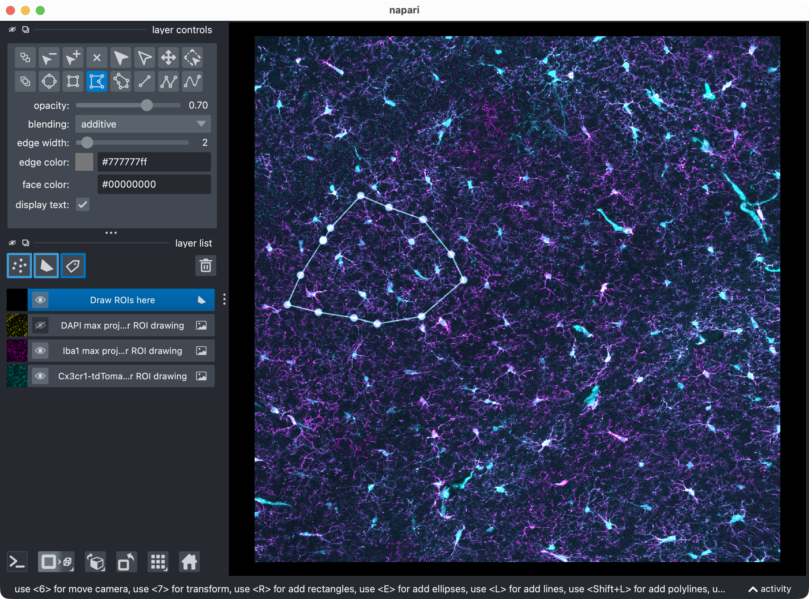
   
   The three image layers (=channels) and the shape layer. Napari allows to draw any arbitrary 2D ROI shapes on top of the image layers. In this tutorial, we draw one ROI in 2D. CellColoc will then apply that ROI across the z dimension for the internal analysis (unless no z-cropping is defined), but the original 3D shape of the ROI is defined in 2D. The ROI drawing step is optional and can be skipped by setting ``USE_FULL_IMAGE_AS_SINGLE_ROI = True``. In that case, the whole image will be treated as one single ROI, and no shape layers will be added to the viewer.

The logic is:

- whole-image mode skips ROI drawing,
- otherwise an existing ROI mask is reused when found,
- otherwise napari opens for interactive ROI drawing.

As in the 2D tutorial, ROIs are drawn in 2D and then applied across the stack
in z for the internal analysis.

Optional: Save drawn ROIs or load an existing ROI mask
------------------------------------------------------

The next cell resolves the actual ROI label image:

.. literalinclude:: ../../user_scripts/microglia_3D_user_script.py
   :language: python
   :start-after: # %% SAVE THE DRAWN ROIS OR LOAD AN EXISTING ROI MASK
   :end-before: # %% RUN THE ROI-WISE SEGMENTATION AND COLOCALIZATION ANALYSIS

Supported modes are:

- one full-image ROI,
- newly drawn ROIs from napari,
- or a previously saved ROI label mask.

After this step, ``roi_labels_2d`` is the final ROI definition used by all
later analysis steps, and the script prints the detected ROI IDs.

Run the ROI-wise segmentation and colocalization analysis
---------------------------------------------------------

The next cell performs the actual 3D segmentation and colocalization run:

.. literalinclude:: ../../user_scripts/microglia_3D_user_script.py
   :language: python
   :start-after: # %% RUN THE ROI-WISE SEGMENTATION AND COLOCALIZATION ANALYSIS
   :end-before: # %% VISUALIZE THE RESULT IN NAPARI

What happens here:

- each ROI is processed separately,
- the microglia channel is segmented with Cellpose,
- the Iba1 channel is segmented with Otsu thresholding,
- per-cell overlaps are computed,
- marker-positive cells are classified,
- result tables and derived masks are assembled.

The returned ``run_result`` stores:

- the current label masks,
- the detailed, summary, and overview tables,
- the current analysis z bounds,
- optional Cellpose refinement caches for later threshold-only rebuilding.

Visualize the result in napari
------------------------------

The next cell opens the current result in napari:

.. literalinclude:: ../../user_scripts/microglia_3D_user_script.py
   :language: python
   :start-after: # %% VISUALIZE THE RESULT IN NAPARI
   :end-before: # %% OPTIONALLY SET OR UPDATE A GLOBAL Z CROP FOR SUBSEQUENT REFINEMENT

.. figure:: _static/microglia_3D_03.png
   :alt: Napari viewer showing the raw image channels together with the derived label layers for ROIs, cell masks, marker masks, and positive-cell masks.
   :align: center
   :figwidth: 100%
.. figure:: _static/microglia_3D_04.png
   :alt: Napari viewer showing the raw image channels together with the derived label layers for ROIs, cell masks, marker masks, and positive-cell masks.
   :align: center
   :figwidth: 100%

   Results of the initial analysis run shown in napari (top: 2D view, bottom: 3D zoomed view of the analyzed ROI). The raw image channels are shown together with the derived label layers for ROIs, cell masks, marker masks, and positive-cell masks. This viewer is the main interactive checkpoint of the 3D workflow. 

This viewer is the main interactive checkpoint of the 3D workflow. It can show:

- the raw microglia channel,
- the raw Iba1 channel,
- the DAPI channel for orientation,
- ROI labels and ROI numbers,
- segmented cell masks,
- segmented marker masks,
- the derived positive-cell mask.

Because the script reuses ``result_viewer`` later on, this is also the viewer
you can edit manually before the manual reanalysis step at the end.

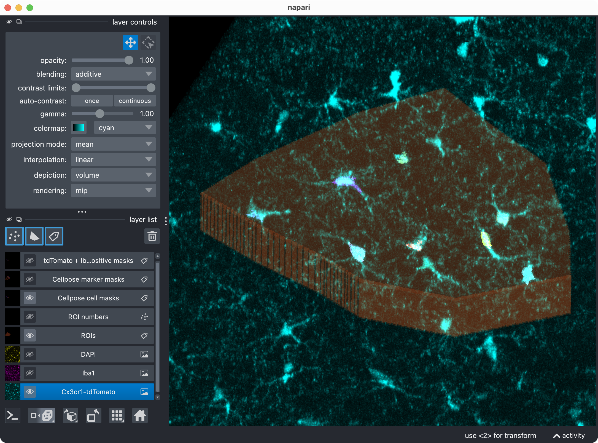
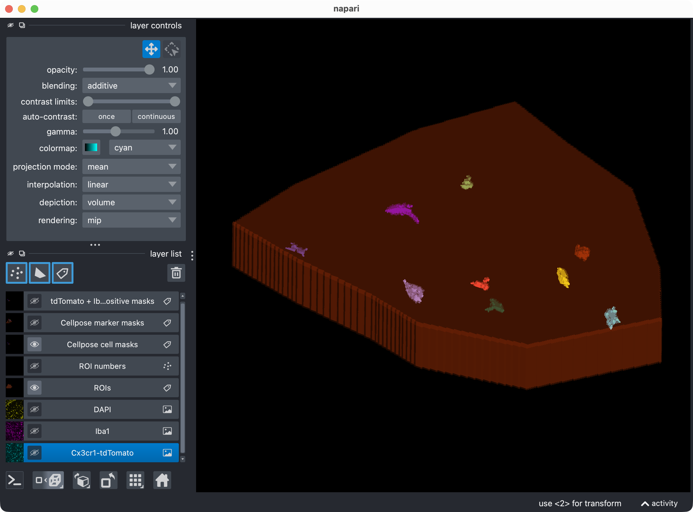

   Inspecting the microglia channel results. Top: Overlay of raw microglia channel (magenta) and segmented cell mask. Bottom: 3D rendering of the same. This is a good time to check whether the Cellpose segmentation worked well across the z dimension, or whether some slices should be excluded from the analysis with a global z-crop before refinement. Also, note that the segmentation of the microglia channel is not perfect: We miss at least one microglial soma in the upper center. In the next refinement step, we will see how to use the Cellpose cache to adjust the cell-channel thresholds and postfilters in order to recover that missed cell without having to rerun Cellpose from scratch on the full 3D stack.

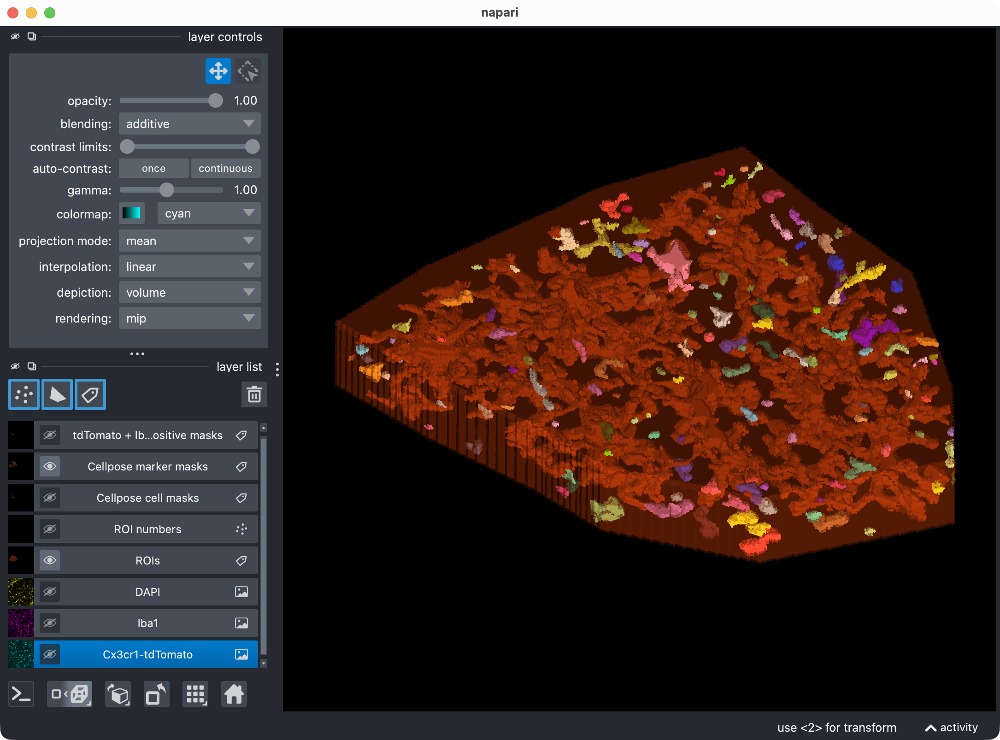
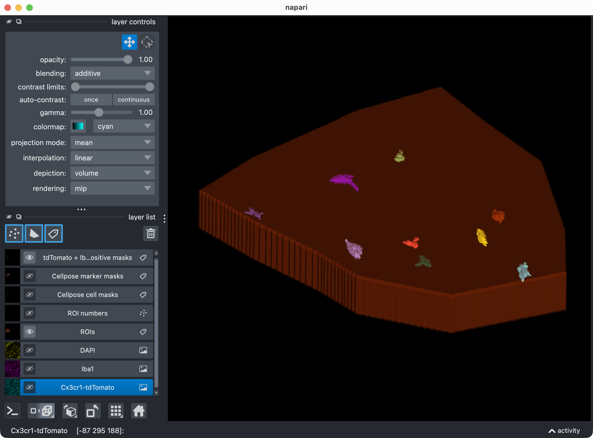

   Top: The segmentation mask of the Iba1 marker channel. Bottom: The resulting colocalization calls. The positive-cell mask shows the microglia that were classified as Iba1-positive based on their overlap with the marker mask. In this example, we have chosen to segment the marker channel with Otsu thresholding, which is not perfect. You may see that the segmentation of the marker channel is resulted into too broad and thick cell processes, which can lead to some false positive colocalization calls in the positive-cell mask. However, for demonstration purposes, this is still a good result as we are at first glance interested in the overall workflow and the overall Iba1-positivity rate of the microglia, rather than in the perfect segmentation of every single cell process in this channel. For a real project, you would of course want to optimize the marker-channel segmentation and the colocalization settings to get the best possible result for your specific data and question.

Optionally set or update a global z-crop for subsequent refinement
------------------------------------------------------------------

This cell is specific to the 3D workflow:

.. literalinclude:: ../../user_scripts/microglia_3D_user_script.py
   :language: python
   :start-after: # %% OPTIONALLY SET OR UPDATE A GLOBAL Z CROP FOR SUBSEQUENT REFINEMENT
   :end-before: # %% OPTIONALLY REFINE RESULTS AND VISUALIZE UPDATED RESULT IN NAPARI

Its purpose is didactic and practical:

- you first inspect the full 3D result,
- then decide whether the upper or lower slices should be excluded from the
  refinement and final quantification,
- and finally rerun the analysis logic in that restricted z interval.

Set:

- ``REFINEMENT_ANALYSIS_Z_CROP = None`` to keep the current analysis range,
- or a tuple such as ``(5, 20)`` to restrict subsequent internal calculations
  to that z interval.

This crop affects all channels and all ROIs consistently during the following
refinement step.

Optionally refine results and visualize the updated result
----------------------------------------------------------

The next cell performs cache-based refinement and then refreshes the napari
layers:

.. literalinclude:: ../../user_scripts/microglia_3D_user_script.py
   :language: python
   :start-after: # %% OPTIONALLY REFINE RESULTS AND VISUALIZE UPDATED RESULT IN NAPARI
   :end-before: # %% OPTIONALLY REANALYZE MANUALLY EDITED LABEL LAYERS FROM NAPARI

This step is especially useful in 3D because a full Cellpose rerun can be
costly. The refinement reuses cached network outputs from the initial Cellpose
run.

The cell demonstrates several advanced ideas at once:

- threshold refinement for the cell channel,
- optional postfilter refinement,
- optional z-crop refinement,
- selective viewer-layer refresh,
- and channel-specific refinement control.

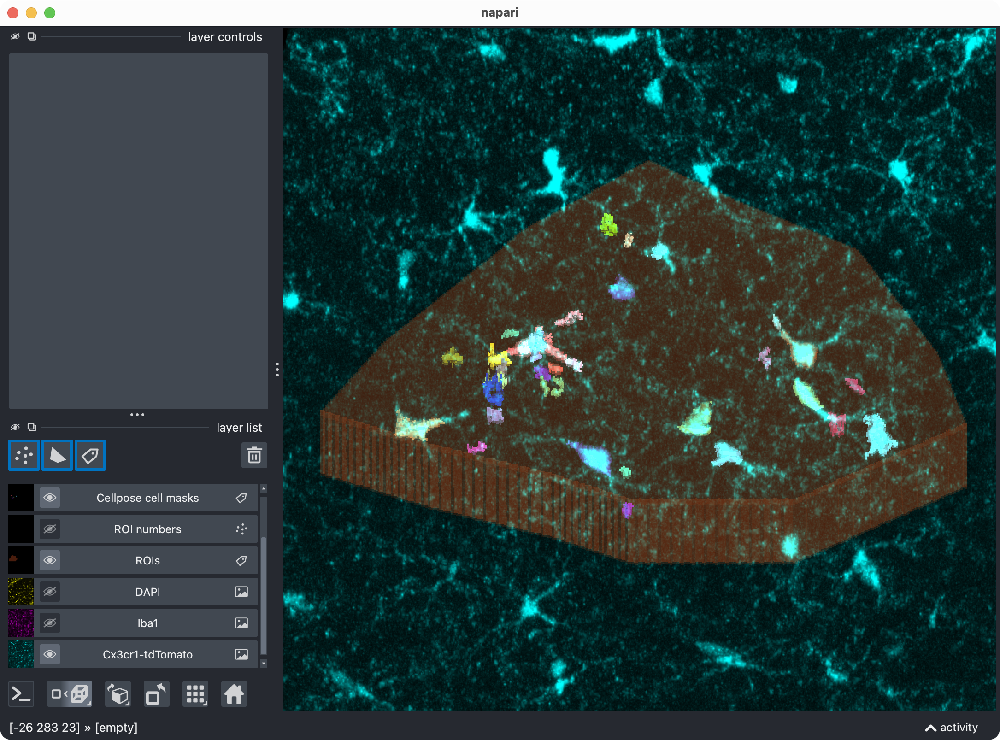
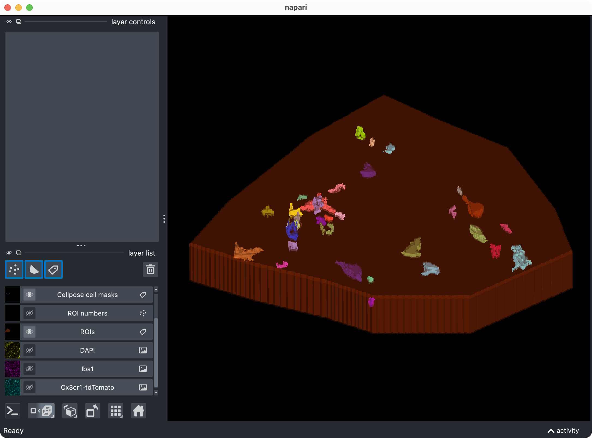

   First refinement attempt in order to recover the missed microglial soma in the upper center. In this case, we adjust Cellpose's `cellprob_threshold` and `flow_threshold` to be more permissive, which allows Cellpose to generate a new candidate mask that includes the missed cell. However, the refined thresholds resulted into a too permissive segmentation with many false positives. 

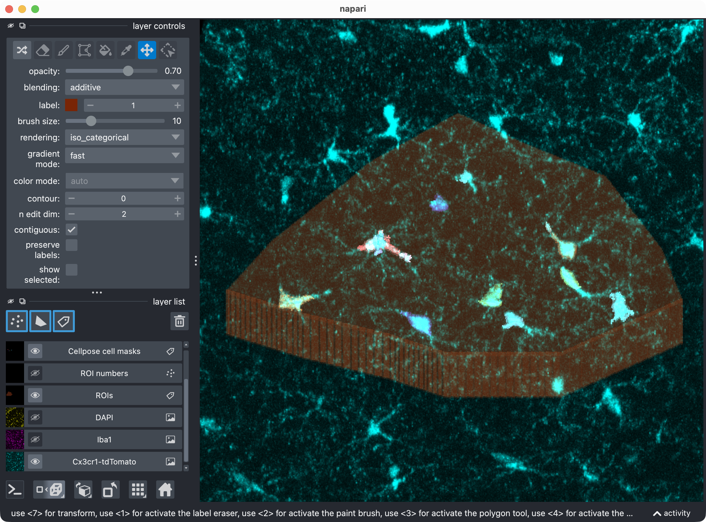
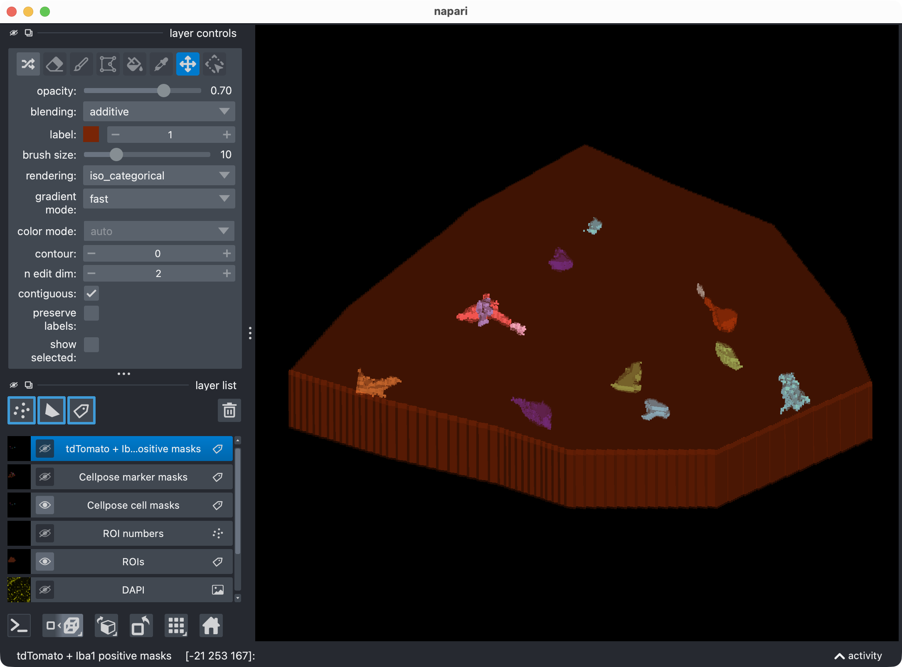

   Final refinement attempt in order to recover the missed microglial soma in the upper center, further fine-tuning Cellpose's `cellprob_threshold` and `flow_threshold`. This time, we find a better balance between sensitivity and specificity, which allows us to recover the missed cell while keeping the false positives at a more manageable level. However, some false positives still remain, which is not ideal. In the next step, we will therefore see how to use napari for manual editing of the segmented label layers, and how to reanalyze those edits with CellColoc's reanalysis function in order to delete some of the false positives while keeping the recovered true positive cell in place.

Channel-selective refinement
~~~~~~~~~~~~~~~~~~~~~~~~~~~~

In the current script, only the cell channel is actually refined:

.. code-block:: python

   marker_model_config=None

inside the call to ``refine_run_result_from_cellpose_cache(...)``.

This means:

- the cell masks are rebuilt from cached Cellpose outputs using the new cell
  thresholds and postfilters,
- the marker masks are kept unchanged from the previous state.

If you want to refine the marker channel as well, pass
``refined_marker_model_config`` instead of ``None``.

Refinement settings
~~~~~~~~~~~~~~~~~~~

The script exposes:

- new Cellpose thresholds for the cell channel,
- nominal marker thresholds,
- optional postfilters for both channels,
- and a possible refinement-time z-crop.

This makes the refinement stage a convenient place for final tuning after the
first qualitative 3D inspection.

Optionally reanalyze manually edited label layers from napari
-------------------------------------------------------------

The final optional analysis cell lets you treat manual napari edits as the new
segmentation truth:

.. literalinclude:: ../../user_scripts/microglia_3D_user_script.py
   :language: python
   :start-after: # %% OPTIONALLY REANALYZE MANUALLY EDITED LABEL LAYERS FROM NAPARI
   :end-before: # %% EXPORT RESULTS

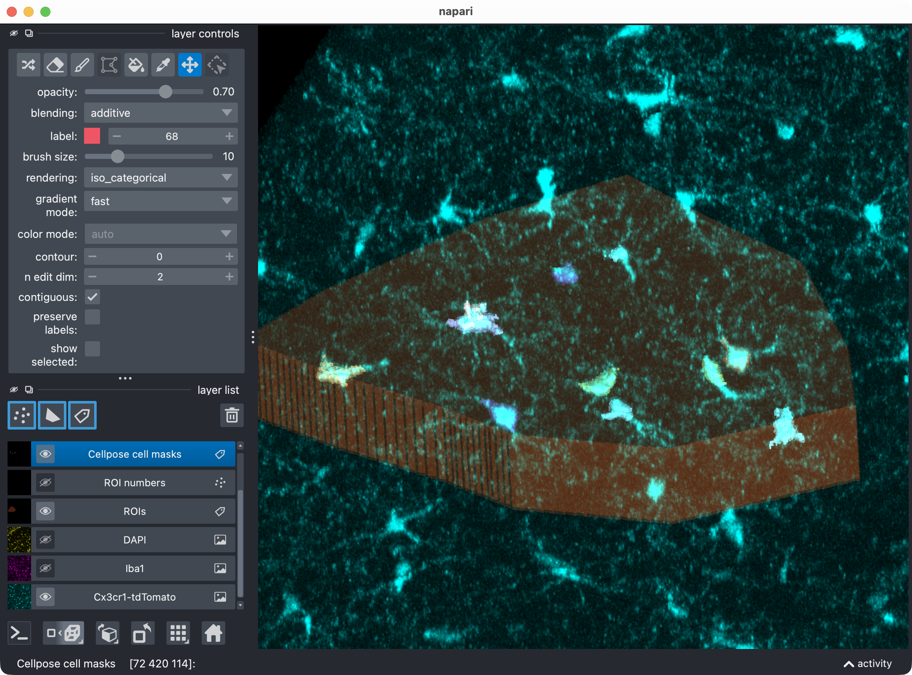
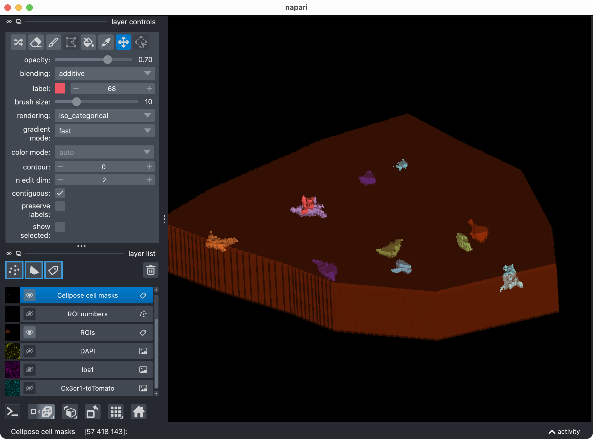

   After manually re-assigning falsely split cell compartments and deleting false positive cells using napari's layer tools, we finally have a clean segmentation of the microglia channel with all true positive cells correctly labeled and most false positives removed. The next step is to let CellColoc treat these manual edits as the new segmentation truth and re-run the colocalization analysis based on those edits. This way, we can keep the manually edited cell masks in place while automatically updating the marker masks, the colocalization calls, and all result tables based on those edits. 
   
.. note::
   **Important: First use the napari viewer opened in the previous cell to manually edit the 
   label layers**, and after you are done with the editing, then run this cell to let CellColoc 
   extract the edited label arrays from the viewer and re-run the analysis based on those edits. 
   **Do not run this cell before you have made your manual edits in napari**, otherwise your edits 
   will not be included in the reanalysis.

This is useful when:

- Cellpose split one soma into multiple labels,
- a false positive should be deleted manually,
- or a thresholded marker mask needs local human correction.

The workflow is:

1. edit the displayed label layers directly in napari,
2. run this cell,
3. let CellColoc extract the edited label arrays from the viewer,
4. recompute the tables based on those edited masks.

Importantly, the script now also passes
``analysis_z_bounds=run_result.analysis_z_bounds`` to the reanalysis function.
This keeps the manual reanalysis consistent with any refinement-time z-crop
that may already have been applied.

Export results
--------------

The final cell writes the accepted analysis result to disk:

.. literalinclude:: ../../user_scripts/microglia_3D_user_script.py
   :language: python
   :start-after: # %% EXPORT RESULTS
   :end-before: # %% END

Outputs are written to the dataset's ``results/`` directory and typically
include:

- ROI mask,
- cell mask,
- marker mask,
- positive-cell mask,
- the detailed CSV table,
- and the combined Excel workbook.

As in the `2D workflow <usage_2d_dapi_stained_nuclei.html>`_, export 
is intentionally placed at the end so that the
saved results represent the final accepted state after any refinement or 
manual editing. Please refer to the 2D workflow for a detailled 
description of the results table.

Adapting this tutorial to your own data
---------------------------------------

To reuse this workflow for your own 3D microscopy project, the most important
settings to adapt are:

- ``DATA_DIR`` and ``SELECTED_FILE_NAME``
- ``CHANNEL_CONFIG``
- ``DISPLAY_NAMES``
- ``VOXEL_SCALE_ZYX``
- ``CELL_MODEL_CONFIG``
- ``MARKER_MODEL_CONFIG``
- ``COLOCALIZATION_CONFIG``
- ``RUNTIME_CONFIG``
- ``USE_FULL_IMAGE_AS_SINGLE_ROI`` and
  ``REUSE_EXISTING_ROI_MASK_IF_AVAILABLE``

For a practical first pass on a new 3D dataset:

1. start with one representative file,
2. use ROI-based analysis rather than whole-image mode when the stack is
   spatially heterogeneous,
3. verify voxel scaling and anisotropy handling early,
4. use ``crop_for_testing`` or ``image_loading_mode="memap"`` if the stack is
   large,
5. inspect the initial result in napari before enabling any refinement,
6. use refinement-time z-cropping if upper or lower slices should be excluded,
7. export only after the 3D result looks correct.
