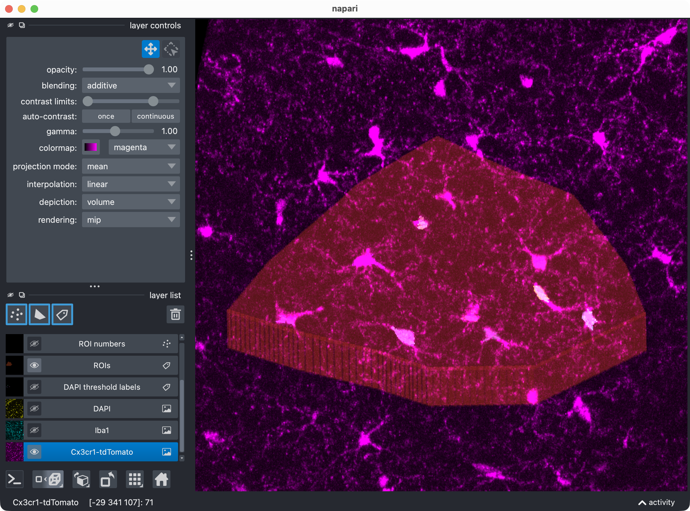
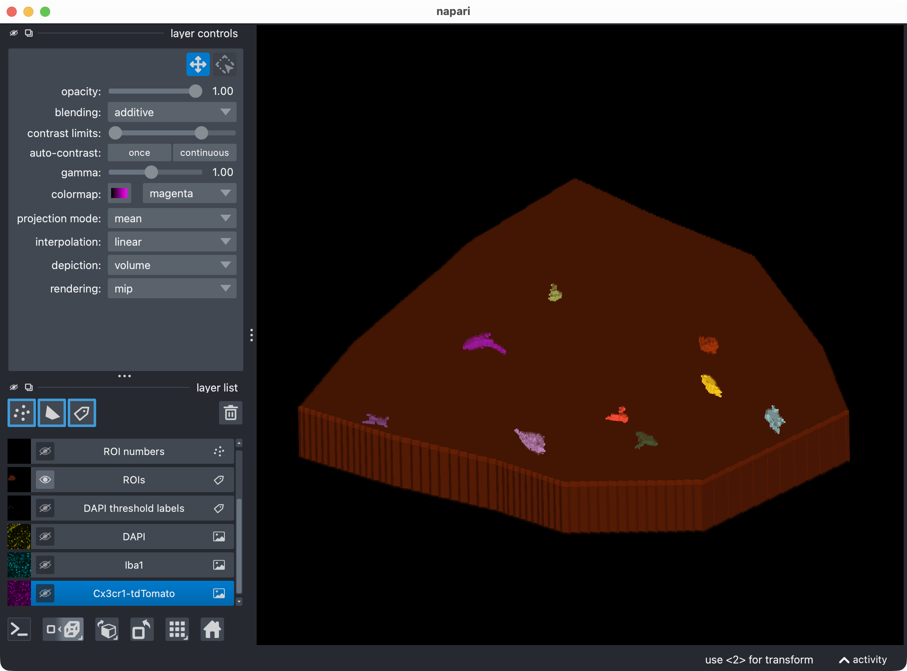
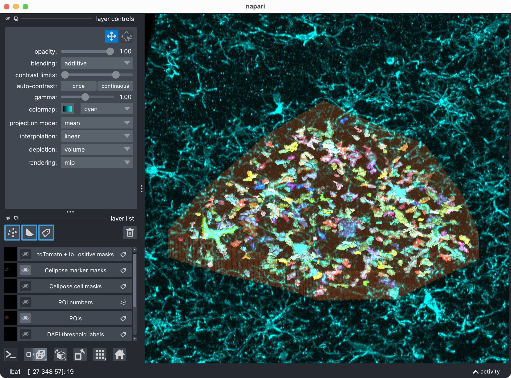
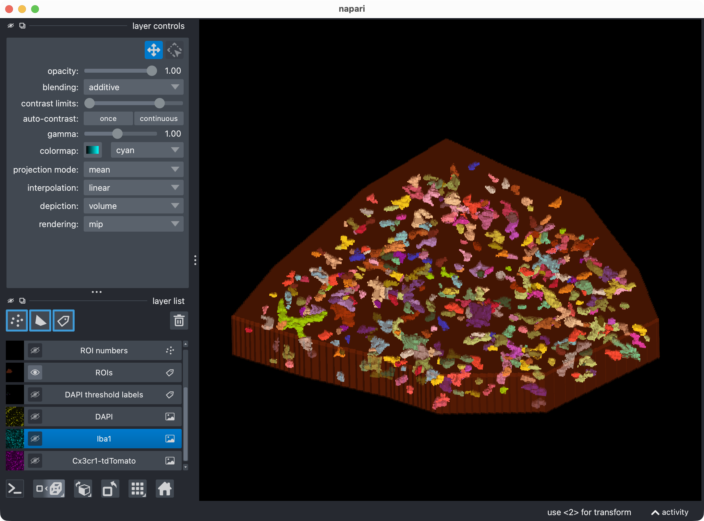
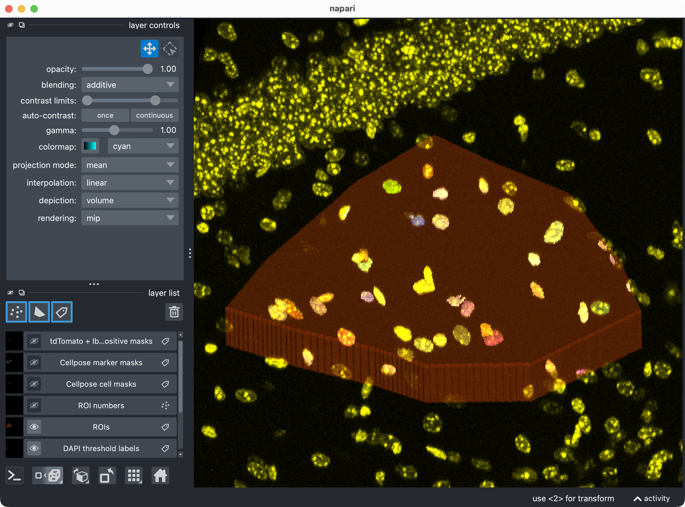
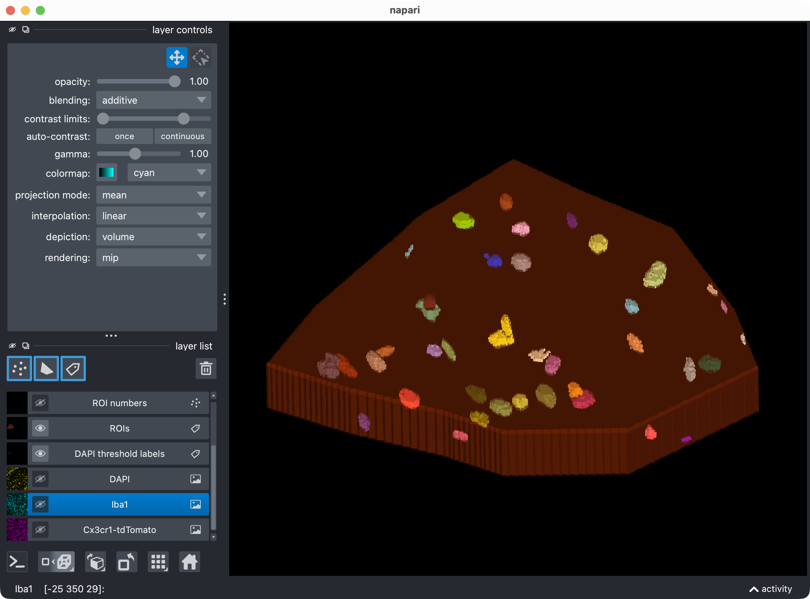
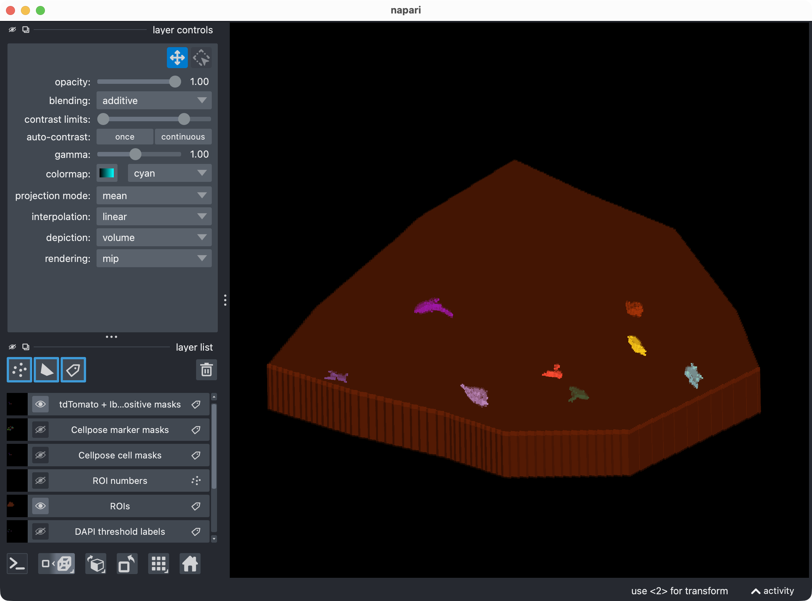
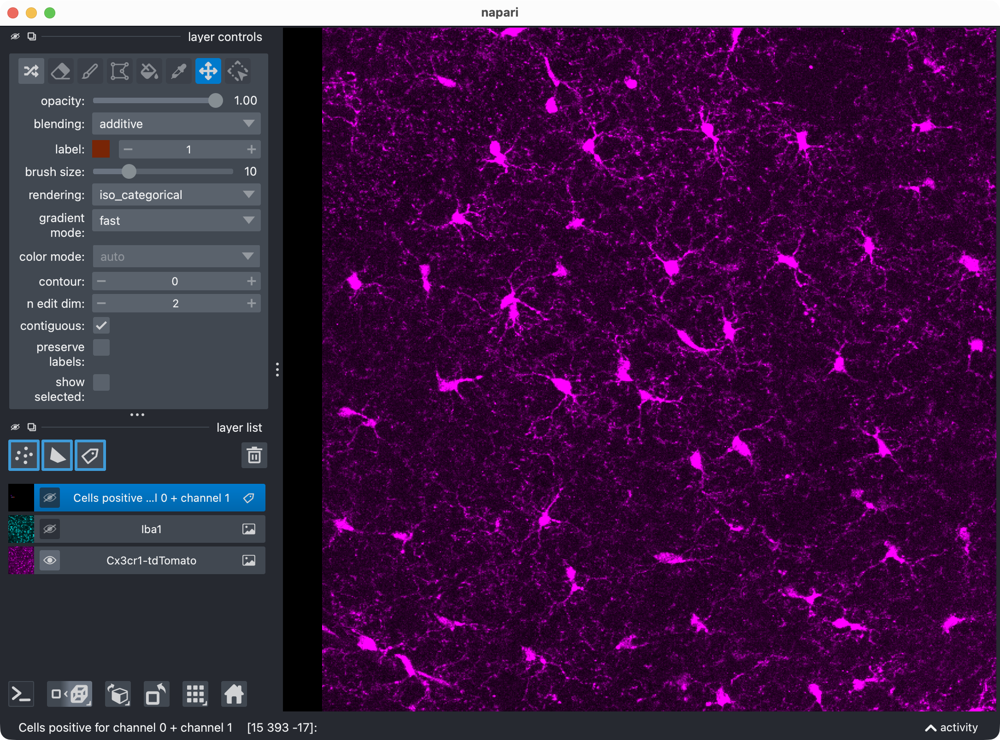
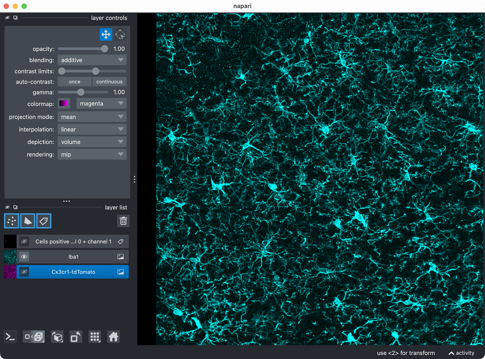
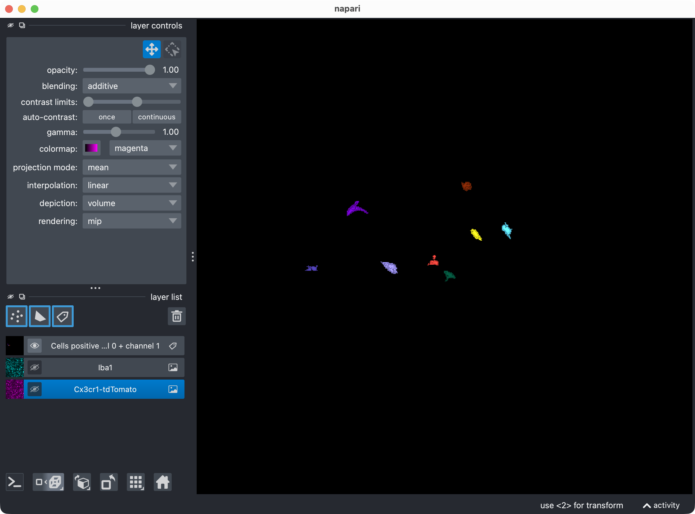

Three-channel analysis tutorial
==============================

This tutorial walks through a complete three-channel CellColoc workflow based
on the interactive Jupyter notebook

``user_scripts/nb_microglia_3D_three_channel_user_script.ipynb``,

which is identical to the interactive Python script

``user_scripts/microglia_3D_three_channel_user_script.py``.

The goal is to show how to analyze a 3D microscopy dataset in which a third
channel is not merely displayed for orientation, but is actively segmented and
included in the downstream analysis.

In particular, this tutorial demonstrates how to:

- segment channel 0, channel 1, and channel 2,
- evaluate channel-0 versus channel-1 positivity,
- evaluate channel-0 versus channel-2 positivity,
- derive channel-0 cells that are positive for both channel 1 and channel 2,
- and inspect each of these positivity views separately in napari.

Dataset used in this tutorial
-----------------------------

The tutorial uses the microglia example data set distributed with CellColoc in

``example_data/microglia_3D/``

Please download the example data from the CellColoc Zenodo example-data record
first, as described in the `Example data set <usage_example_datasets.html>`_
section. Store the downloaded files locally in a convenient place. For the
remainder of this tutorial, we assume that the downloaded files are available
relative to the current working directory or current example script in:

``example_data/microglia_3D/``

The script is written to handle one selected file from that folder at a time.

This is a 3D multichannel fluorescence dataset. In this tutorial, we treat:

- channel 0 as the primary ``cell`` channel
  (``Cx3cr1-tdTomato`` microglia reporter signal),
- channel 1 as the first marker channel
  (``Iba1`` staining),
- channel 2 as the second marker-like channel
  (``DAPI`` in this demo setup).

.. figure:: _static/microglia_3D_00.png
   :alt: 3D multi-channel image stack of hippocampal CA1 tissue, showing microglia, Iba1, and DAPI channels in napari.
   :align: center
   :figwidth: 100%
.. figure:: _static/microglia_3D_01.png
   :alt: 3D multi-channel image stack of hippocampal CA1 tissue, showing microglia, Iba1, and DAPI channels in napari.
   :align: center
   :figwidth: 100%
   
   The 3D multi-channel image stack with the raw microglia (magenta), Iba1 (cyan), and DAPI (yellow) channels shown in Napari. Top shows 2D representation, bottom shows 3D representation. The DAPI channel is used for anatomical orientation but not segmented in this tutorial. The microglia channel is segmented with Cellpose, while the Iba1 channel is segmented with Otsu thresholding. 

This tutorial is intentionally a *feature demonstration* of CellColoc's
optional third-channel analysis. It shows how a third channel can be segmented
and included in the per-cell logic even if the biological meaning of that
channel differs from project to project. The same structure can be reused for 
other 3D multichannel datasets by adapting the path selection, channel assignment, 
display names, and segmentation settings.

How to use this tutorial
------------------------

The associated user script

``user_scripts/nb_microglia_3D_three_channel_user_script.ipynb``

is organized in cells, reflecting the structure of this tutorial. The same
accounts for the alternative Python script (there: ``# %%`` cells)

``user_scripts/microglia_3D_three_channel_user_script.py``.

The recommended way to follow this tutorial is:

1. open
   ``user_scripts/nb_microglia_3D_three_channel_user_script.ipynb`` or
   ``user_scripts/microglia_3D_three_channel_user_script.py``,
2. run the cells from top to bottom,
3. adjust only the configuration values that are relevant for your own data.

The subsections below follow the same order as the script cells.

Imports
-------

The first cell imports the public CellColoc API, napari, NumPy, and
``dataclasses.replace``:

.. literalinclude:: ../../user_scripts/microglia_3D_three_channel_user_script.py
   :language: python
   :start-after: # %% IMPORTS
   :end-before: # %% PROJECT SETTINGS

What this cell does:

- locates the repository root,
- imports the reusable CellColoc workflow functions,
- imports napari for ROI drawing and result inspection,
- imports ``build_positive_cell_mask`` to create channel-specific positivity
  views at the end.

Project settings
----------------

The project settings cell contains the full three-channel analysis
configuration:

.. literalinclude:: ../../user_scripts/microglia_3D_three_channel_user_script.py
   :language: python
   :start-after: # %% PROJECT SETTINGS
   :end-before: # %% LOAD THE ANALYSIS CHANNELS

This is the main cell you would adapt for your own three-channel dataset.

Input-file discovery and selection
~~~~~~~~~~~~~~~~~~~~~~~~~~~~~~~~~~

The script scans ``example_data/microglia_3D/`` for supported microscopy files
and lets you select one through:

.. code-block:: python

   SELECTED_FILE_NAME = DATA_PATHS[0].name

Channel assignment and roles
~~~~~~~~~~~~~~~~~~~~~~~~~~~~

``CHANNEL_CONFIG`` assigns three raw channels:

- ``cell_channel=0``:
  the channel that defines the primary segmented cell objects,
- ``marker_channel=1``:
  the first positivity marker channel,
- ``optional_region_channel=2``:
  the optional third analysis channel.

The naming ``optional_region_channel`` comes from the package's generic API,
but the channel is no longer restricted to occupancy-only use cases. In this
tutorial, it is actively segmented and used in the per-cell positivity logic.

Display names
~~~~~~~~~~~~~

``DISPLAY_NAMES`` controls how the channels and result layers appear in napari.
For real projects, you should replace the generic biological placeholders with
the exact marker names of your own experiment.

Voxel scale
~~~~~~~~~~~

``VOXEL_SCALE_ZYX`` is set to ``None`` here so that CellColoc first tries to
resolve the voxel size from OMIO metadata. If needed, you can also provide it
explicitly as:

- a full ``(Z, Y, X)`` tuple for 3D datasets,
- or, in 2D-oriented workflows, as ``(Y, X)``.

Three segmentation configs
~~~~~~~~~~~~~~~~~~~~~~~~~~

This script defines three independent ``CellposeModelConfig`` objects:

- ``CELL_MODEL_CONFIG``
- ``MARKER_MODEL_CONFIG``
- ``OPTIONAL_REGION_MODEL_CONFIG``

In this demonstration, all three channels are segmented with Cellpose
(``segmentation_method="cellpose"``), even though CellColoc would also allow
threshold-based segmentation for any of them.

This is useful because it shows that the optional third channel can
participate in:

- segmentation,
- occupancy quantification,
- per-cell positivity analysis,
- cache-based threshold refinement.

Third-channel cell positivity switch
~~~~~~~~~~~~~~~~~~~~~~~~~~~~~~~~~~~~

The key switch for this tutorial is:

.. code-block:: python

   evaluate_optional_region_cell_positivity=True

inside ``COLOCALIZATION_CONFIG``.

This tells CellColoc to do more than just quantify occupancy for the third
channel. It additionally evaluates:

- which channel-0 cells are positive with respect to channel 2,
- and which channel-0 cells are positive for both channel 1 and channel 2.

Runtime settings and ROI mode
~~~~~~~~~~~~~~~~~~~~~~~~~~~~~

The runtime settings behave just like in the standard 3D tutorial:

- ``image_loading_mode="memap"`` for disk-backed loading,
- optional ROI drawing or whole-image mode,
- reuse of an existing ROI mask when available.

The script defaults to ROI-based analysis:

.. code-block:: python

   USE_FULL_IMAGE_AS_SINGLE_ROI = False

If you want to analyze the full field of view directly, set this to ``True``.

Load the analysis channels
--------------------------

The next cell loads the selected stack and the configured channels:

.. literalinclude:: ../../user_scripts/microglia_3D_three_channel_user_script.py
   :language: python
   :start-after: # %% LOAD THE ANALYSIS CHANNELS
   :end-before: # %% DRAW ROIS INTERACTIVELY IN NAPARI

This step:

- opens the microscopy dataset through OMIO,
- extracts all three configured analysis channels,
- resolves voxel size,
- prepares the standardized results folder,
- optionally checks whether a previously saved ROI mask already exists.

Optional ROI drawing and ROI reuse
----------------------------------

The next two cells behave like in the other tutorials:

.. literalinclude:: ../../user_scripts/microglia_3D_three_channel_user_script.py
   :language: python
   :start-after: # %% DRAW ROIS INTERACTIVELY IN NAPARI
   :end-before: # %% RUN THE ROI-WISE THREE-CHANNEL SEGMENTATION AND COLOCALIZATION ANALYSIS

They support three modes:

- whole-image analysis as one single ROI,
- interactive ROI drawing in napari,
- reuse of a previously saved ROI mask from the ``results/`` folder.

This keeps the three-channel example fully compatible with the same
interactive, reproducible ROI workflow as the other CellColoc scripts.

Run the ROI-wise three-channel segmentation and colocalization analysis
-----------------------------------------------------------------------

This is the main analysis step:

.. literalinclude:: ../../user_scripts/microglia_3D_three_channel_user_script.py
   :language: python
   :start-after: # %% RUN THE ROI-WISE THREE-CHANNEL SEGMENTATION AND COLOCALIZATION ANALYSIS
   :end-before: # %% VISUALIZE THE BASE RESULT IN NAPARI

What happens here:

- channel 0 is segmented as the primary cell-object channel,
- channel 1 is segmented as the first marker channel,
- channel 2 is segmented as the optional third analysis channel,
- per-cell overlap is computed for channel 0 versus channel 1,
- optional per-cell overlap is also computed for channel 0 versus channel 2,
- ROI-level occupancy is computed for all segmented channels,
- summary and overview tables are assembled.

Because ``evaluate_optional_region_cell_positivity=True``, the summary table
contains additional columns such as:

- ``optional_region_positive``
- ``marker_and_optional_region_positive``

These are the basis for the later demonstration cells that show different
positivity subsets separately.

Visualize the base result in napari
-----------------------------------

The next cell opens the base result in napari:

.. literalinclude:: ../../user_scripts/microglia_3D_three_channel_user_script.py
   :language: python
   :start-after: # %% VISUALIZE THE BASE RESULT IN NAPARI
   :end-before: # %% OPTIONALLY SET OR UPDATE A GLOBAL Z CROP FOR SUBSEQUENT REFINEMENT

.. figure:: _static/microglia_3D_three_chan_00.png
   :alt: 3D multi-channel image stack of hippocampal CA1 tissue, showing microglia, Iba1, and DAPI channels in napari, along with their segmented label layers and ROI labels.
   :align: center
   :figwidth: 100%
   
   The 3D multi-channel image stack with the raw microglia (magenta), Iba1 (cyan), and DAPI (yellow) channels shown in Napari. In this tutorial, we also segmented the optional third channel (DAPI) and included it in the per-cell positivity analysis. The microglia channel is segmented with Cellpose, while the Iba1 channel is segmented with Otsu thresholding. 

This viewer can show:

- the raw cell channel,
- the raw marker channel,
- the raw third channel,
- ROI labels,
- cell masks,
- marker masks,
- positive-cell masks,
- the segmented third-channel labels.

This is the main checkpoint where you can verify that all three segmentation
paths look plausible before moving on to refinement.

.. figure:: _static/microglia_3D_three_chan_01.png
   :alt: Zoom onto the analyzed ROI, showing all channels and their segmented label layers.
   :align: center
   :figwidth: 100%

   
   Top: Zoom onto the analyzed ROI, showing all channels and their segmented label layers. Center: Microglia channel only. Bottom: Segmentation layer of the microglia channel, showing the Cellpose-segmented cell objects. Note that we miss the upper center microglia cell, while the remaining cells are segmented correctly. This is a typical Cellpose segmentation result that can be improved with the optional refinement step.

   
   Top: Zoom onto the analyzed ROI, showing the marker channel and its segmented label layer. Bottom: Marker channel only. The marker channel is segmented with Otsu thresholding, which results in a rather rough mask. However, since we are only interested in per-cell positivity (which microglia is Iba1-positive?), this is sufficient for the current demonstration.

   
   Top: Zoom onto the analyzed ROI, showing the optional third channel and its segmented label layer. Bottom: Segmented third channel only. The optional third channel is segmented with Cellpose, which results in an almost perfect mask this time. This shows that the optional third channel can be segmented and included in the per-cell positivity analysis, even if its biological meaning differs from the first marker channel. It also demonstrates that Cellpose's segmentation quality can vary across channels and tends to work best for more "roundish" objects (the microglia's processes complicate the Cellpose segmentation).

   
   Microglia segmentation layer, including only cells that are both Iba1-positive and DAPI-positive. This is the most specific view of the three-channel analysis, showing only microglia that are positive for both marker channels. It demonstrates that the optional third channel can be used to refine the per-cell positivity analysis and create more specific subsets of cells.

Optional global z-crop for refinement
-------------------------------------

The next cell lets you define or update a global z interval for the following
refinement step:

.. literalinclude:: ../../user_scripts/microglia_3D_three_channel_user_script.py
   :language: python
   :start-after: # %% OPTIONALLY SET OR UPDATE A GLOBAL Z CROP FOR SUBSEQUENT REFINEMENT
   :end-before: # %% OPTIONALLY REFINE ALL THREE CHANNELS AND VISUALIZE UPDATED RESULT IN NAPARI

As in the regular `3D tutorial <usage_3d_microglia.html>`_, this allows you to:

- inspect the full 3D result first,
- then restrict refinement and quantification to a chosen z interval,
- while keeping the original XY ROI definition unchanged.

Optionally refine all three channels and visualize the updated result
---------------------------------------------------------------------

The next cell demonstrates cache-based threshold refinement for *all three*
Cellpose-segmented channels:

.. literalinclude:: ../../user_scripts/microglia_3D_three_channel_user_script.py
   :language: python
   :start-after: # %% OPTIONALLY REFINE ALL THREE CHANNELS AND VISUALIZE UPDATED RESULT IN NAPARI
   :end-before: # %% OPTIONALLY REANALYZE MANUALLY EDITED LABEL LAYERS FROM NAPARI

Thus, the optional third analysis channel can be refined in the same way as the 
first two channels. Overall, the cell demonstrates:

- Cellpose threshold refinement for the cell channel,
- Cellpose threshold refinement for the marker channel,
- Cellpose threshold refinement for the third channel,
- optional postfilters for all three channels,
- optional refinement-time z cropping,
- viewer refresh with the updated three-channel result.

Important refinement parameters are:

- ``REFINED_CELL_*``
- ``REFINED_MARKER_*``
- ``REFINED_OPTIONAL_REGION_*``

Each group contains:

- ``CELLPROB_THRESHOLD``
- ``FLOW_THRESHOLD``
- optional postfilter selector
- optional postfilter parameters

This makes the three-channel script a good template for experiments in which
all analyzed channels should remain editable and tunable after the initial
segmentation run. For a detailled walkthrough through each refinement step, please
refer to the `3D data analysis tutorial <usage_3d_microglia.html>`_.

Optional manual reanalysis after napari edits
---------------------------------------------

The next cell supports manual label editing followed by full reanalysis:

.. literalinclude:: ../../user_scripts/microglia_3D_three_channel_user_script.py
   :language: python
   :start-after: # %% OPTIONALLY REANALYZE MANUALLY EDITED LABEL LAYERS FROM NAPARI
   :end-before: # %% VISUALIZE CELLS POSITIVE FOR CHANNEL 0 + CHANNEL 1

This behaves similarly to the manual reanalysis in the standard 3D tutorial.
In the current demo, the manual reanalysis can read back the edited cell and
marker layers. The third-channel masks are reused from the current
``run_result``. For a detailled walkthrough, please
refer to the `3D data analysis tutorial <usage_3d_microglia.html>`_.

Visualize cells positive for channel 0 + channel 1
--------------------------------------------------

The next cell creates a positivity mask for cells that are positive with
respect to channel 1:

.. literalinclude:: ../../user_scripts/microglia_3D_three_channel_user_script.py
   :language: python
   :start-after: # %% VISUALIZE CELLS POSITIVE FOR CHANNEL 0 + CHANNEL 1
   :end-before: # %% VISUALIZE CELLS POSITIVE FOR CHANNEL 0 + CHANNEL 2

Internally, this uses:

- ``run_result.tables.summary["marker_positive"]``
- and ``build_positive_cell_mask(...)``

This is the standard two-channel positivity view which you get when analyzing only two channels.

.. figure:: _static/microglia_3D_three_chan_14.png
   :alt: Overview of the microglia and Iba1 channels, showing the microglia channel (magenta) and the Iba1 channel (cyan) in Napari. 
   :align: center
   :figwidth: 100%

   
   Top: Overview of the microglia (magenta) and Iba1 (cyan) channels. Center top: The microglia channel only. Center bottom: The Iba1 channel only. Bottom: Segmentation layer of the Iba1-positive cells.

Visualize cells positive for channel 0 + channel 2
--------------------------------------------------

The next cell creates a positivity mask for cells that are positive with
respect to the optional third channel:

.. literalinclude:: ../../user_scripts/microglia_3D_three_channel_user_script.py
   :language: python
   :start-after: # %% VISUALIZE CELLS POSITIVE FOR CHANNEL 0 + CHANNEL 2
   :end-before: # %% VISUALIZE CELLS POSITIVE FOR CHANNEL 0 + CHANNEL 1 + CHANNEL 2

Here the script temporarily maps:

- ``summary["optional_region_positive"]``

onto the ``marker_positive`` column expected by
``build_positive_cell_mask(...)``.

This gives you a clean standalone view of channel-0 cells that are positive
for the third channel, independently of channel 1.

Visualize cells positive for channel 0 + channel 1 + channel 2
---------------------------------------------------------------

The final dedicated positivity-view cell shows cells that are positive for
both marker channels:

.. literalinclude:: ../../user_scripts/microglia_3D_three_channel_user_script.py
   :language: python
   :start-after: # %% VISUALIZE CELLS POSITIVE FOR CHANNEL 0 + CHANNEL 1 + CHANNEL 2
   :end-before: # %% EXPORT RESULTS

This uses:

- ``summary["marker_and_optional_region_positive"]``

and therefore corresponds to the logical AND of:

- channel-0 versus channel-1 positivity,
- channel-0 versus channel-2 positivity.

.. figure:: _static/microglia_3D_three_chan_09.png
   :alt: Overview of the microglia (magenta), Iba1 (cyan), and optional third channel (yellow), along with the segmentation layer of the microglia cells that are positive for both marker channels.
   :align: center
   :figwidth: 100%
   
   Top: Overview of the microglia (magenta), Iba1 (cyan), and optional third channel (yellow), along with the segmentation layer of the microglia cells that are positive for both marker channels. 

Export results
--------------

The final cell writes the result bundle to the standardized ``results/``
directory:

.. literalinclude:: ../../user_scripts/microglia_3D_three_channel_user_script.py
   :language: python
   :start-after: # %% EXPORT RESULTS
   :end-before: # %% END

As in the other tutorials, the export is intentionally placed at the end so
that the saved outputs reflect the final accepted state after optional
refinement or manual editing.

When to use this tutorial
-------------------------

This three-channel workflow is especially useful when:

- channel 3 should contribute more than occupancy,
- you want separate cell-positivity calls for two marker channels,
- you want to visualize different positivity subsets explicitly,
- you want to demonstrate or test CellColoc's generalized third-channel logic.

For simpler projects, the 2D or standard 3D tutorials are usually the better
starting point. This tutorial is best understood as the advanced extension of
those workflows.
