Three-channel analysis with z-projection tutorial
=================================================

This tutorial walks through a three-channel CellColoc workflow based on the
interactive Jupyter notebook

``user_scripts/nb_microglia_3D_three_channel_zproject_user_script.ipynb``,

which is identical to the interactive Python script

``user_scripts/microglia_3D_three_channel_zproject_user_script.py``.

The goal of this tutorial is to show when and how a nominally 3D microscopy
stack can be projected along the z axis before segmentation and downstream
colocalization analysis. This can be a very useful strategy because true 3D 
Cellpose segmentation is computationally expensive. 

**When, and only when**,

- **the *same* biological cells are visible in the relevant channels,**
- **these channels mainly differ in staining or marker identity rather than in
  which objects are present,**
- **and the cells are not densely stacked on top of one another along z,**

then a z-projection can be a good approximation.

In that situation, CellColoc's z-projection workflow often offers two
practical advantages:

- the analysis becomes substantially faster,
- and the projected 2D image may even segment more robustly because signal
  from many z slices is compressed into one plane.

But this comes with a tradeoff: By projecting, you deliberately give up one spatial
axis and therefore lose true 3D object geometry. This tutorial therefore shows
z-projection as an *optional strategy* and not as a universal replacement for
full 3D analysis.

Dataset used in this tutorial
-----------------------------

The tutorial uses the microglia example data set distributed with CellColoc in

``example_data/microglia_3D/``

Please download the example data from the CellColoc Zenodo example-data record
first, as described in the `Example data set <usage_example_datasets.html>`_
section. Store the downloaded files locally in a convenient place. For the
remainder of this tutorial, we assume that the downloaded files are available
relative to the current working directory or current example script in:

``example_data/microglia_3D/``

The script is written to handle one selected file from that folder at a time.

This is a real 3D multichannel fluorescence dataset. In this tutorial, we
treat:

- channel 0 as the primary ``cell`` channel
  (``Cx3cr1-tdTomato`` microglia reporter signal),
- channel 1 as the first marker channel
  (``Iba1`` staining),
- channel 2 as the optional third analysis channel
  (``DAPI`` in this demo setup).

.. figure:: _static/microglia_3D_00.png
   :alt: 3D multi-channel image stack of hippocampal CA1 tissue, showing microglia, Iba1, and DAPI channels in napari.
   :align: center
   :figwidth: 100%
.. figure:: _static/microglia_3D_01.png
   :alt: 3D multi-channel image stack of hippocampal CA1 tissue, showing microglia, Iba1, and DAPI channels in napari.
   :align: center
   :figwidth: 100%
   
   The 3D multi-channel image stack with the raw microglia (magenta), Iba1 (cyan), and DAPI (yellow) channels shown in Napari. Top shows 2D representation, bottom shows 3D representation. The DAPI channel is used for anatomical orientation but not segmented in this tutorial. The microglia channel is segmented with Cellpose, while the Iba1 channel is segmented with Otsu thresholding. 

The biological idea of this tutorial is to demonstrate the mechanics of:

- projecting a 3D stack into a 2D analysis view,
- segmenting multiple channels on that projected view,
- evaluating channel-0 positivity against both channel 1 and channel 2,
- and inspecting the resulting positivity combinations separately.

How to use this tutorial
------------------------

The associated user script

``user_scripts/nb_microglia_3D_three_channel_zproject_user_script.ipynb``

is organized in cells, reflecting the structure of this tutorial. The same
applies to the alternative Python script (there: ``# %%`` cells)

``user_scripts/microglia_3D_three_channel_zproject_user_script.py``.

The recommended way to follow this tutorial is:

1. open
   ``user_scripts/nb_microglia_3D_three_channel_zproject_user_script.ipynb`` or
   ``user_scripts/microglia_3D_three_channel_zproject_user_script.py``,
2. run the cells from top to bottom,
3. adapt the configuration values for your own dataset only where needed.

The subsections below follow the same order as the script cells.

Imports
-------

The first cell imports the public CellColoc API, napari, NumPy, and
``dataclasses.replace``:

.. literalinclude:: ../../user_scripts/microglia_3D_three_channel_zproject_user_script.py
   :language: python
   :start-after: # %% IMPORTS
   :end-before: # %% PROJECT SETTINGS

What this cell does:

- locates the repository root,
- imports the reusable CellColoc workflow functions,
- imports napari for ROI drawing and interactive inspection,
- imports ``build_positive_cell_mask`` for the dedicated positivity views at
  the end,
- imports ``replace`` so that temporary refinement configs can be derived from
  the original base configs without overwriting them.

Project settings
----------------

The project settings cell contains the full configuration for this projected
three-channel workflow:

.. literalinclude:: ../../user_scripts/microglia_3D_three_channel_zproject_user_script.py
   :language: python
   :start-after: # %% PROJECT SETTINGS
   :end-before: # %% LOAD THE ANALYSIS CHANNELS

This is the most important cell to adapt for your own projected 3D analysis.

Input-file discovery and selection
~~~~~~~~~~~~~~~~~~~~~~~~~~~~~~~~~~

The script scans ``example_data/microglia_3D/`` for supported microscopy files
and lets you select one through:

.. code-block:: python

   SELECTED_FILE_NAME = DATA_PATHS[0].name

To analyze a different stack from the same folder, simply change that
assignment.

Channel assignment and display names
~~~~~~~~~~~~~~~~~~~~~~~~~~~~~~~~~~~~

``CHANNEL_CONFIG`` assigns the three analysis channels:

- ``cell_channel=0``
- ``marker_channel=1``
- ``optional_region_channel=2``

``DISPLAY_NAMES`` controls how those channels and result layers appear in
napari.

In this tutorial, all three channels are part of the analysis. The third
channel is not only displayed for orientation, but also segmented and included
in downstream per-cell positivity analysis.

Voxel scale
~~~~~~~~~~~

``VOXEL_SCALE_ZYX`` is set to ``None`` here. This tells CellColoc to first try
to resolve the voxel size from OMIO metadata. If needed, you can also provide
it explicitly as:

- a full ``(Z, Y, X)`` tuple for 3D datasets,
- or, for 2D-oriented workflows, as a shorter ``(Y, X)`` tuple.

Why z-projection is configured in the cell config
~~~~~~~~~~~~~~~~~~~~~~~~~~~~~~~~~~~~~~~~~~~~~~~~~

The key option for this tutorial is:

.. code-block:: python

   z_projection="max"

in ``CELL_MODEL_CONFIG``.

This tells CellColoc to project the stack along z before segmentation and
analysis. Supported projection methods are:

- ``None``: do not project,
- ``"max"``
- ``"mean"``
- ``"median"``
- ``"std"``
- ``"var"``

If you additionally define ``z_crop=(z_start, z_stop)``, only that z interval
is projected.

Once a projection is active:

- CellColoc automatically applies the same projection to all channels,
- the analysis runs on the resulting 2D view rather than on the full 3D
  stack,
- later visualizations also show the projected analysis image,
- and Cellpose is automatically run in the effective 2D mode for the projected
  channel.

Segmentation configurations
~~~~~~~~~~~~~~~~~~~~~~~~~~~

This tutorial defines three channel configs:

- ``CELL_MODEL_CONFIG``
- ``MARKER_MODEL_CONFIG``
- ``OPTIONAL_REGION_MODEL_CONFIG``

The important idea is that CellColoc lets you mix segmentation backends even
in a projected workflow.

In the current script:

- channel 0 uses Cellpose with ``segmentation_method="cellpose"``,
- channel 1 uses a classical threshold-based workflow with
  ``segmentation_method="otsu"``,
- channel 2 uses Cellpose again.

This mixed setup is deliberate. It shows that z-projection is not tied to one
single segmentation backend.

Optional third channel
~~~~~~~~~~~~~~~~~~~~~~

``OPTIONAL_REGION_MODEL_CONFIG`` activates segmentation of the third channel.
Directly below that config, the script contains an explanatory block showing
how to disable the third channel again if you want to fall back to a
two-channel workflow.

In short, you would then:

- set ``optional_region_channel=None`` in ``CHANNEL_CONFIG``,
- set ``OPTIONAL_REGION_MODEL_CONFIG = None``,
- set ``evaluate_optional_region_cell_positivity=False`` in
  ``COLOCALIZATION_CONFIG``,
- and skip the later dedicated third-channel positivity views.

Third-channel positivity evaluation
~~~~~~~~~~~~~~~~~~~~~~~~~~~~~~~~~~~

The key switch that activates per-cell positivity analysis against channel 2
is:

.. code-block:: python

   evaluate_optional_region_cell_positivity=True

inside ``COLOCALIZATION_CONFIG``.

This means the script reports not only:

- which channel-0 cells are positive against channel 1,

but also:

- which channel-0 cells are positive against channel 2,
- and which channel-0 cells are positive for both channel 1 and channel 2.

Runtime settings and ROI mode
~~~~~~~~~~~~~~~~~~~~~~~~~~~~~

The runtime settings control the interactive analysis mode:

- ``image_loading_mode="memap"`` uses OMIO's disk-backed loading mode,
- ``USE_FULL_IMAGE_AS_SINGLE_ROI = False`` enables ROI-based analysis,
- ``REUSE_EXISTING_ROI_MASK_IF_AVAILABLE = True`` reuses a saved ROI mask when
  available.

If you want to analyze the full field of view as one ROI, set:

.. code-block:: python

   USE_FULL_IMAGE_AS_SINGLE_ROI = True

Load the analysis channels
--------------------------

The next cell loads the selected stack and then prepares the projected
analysis view:

.. literalinclude:: ../../user_scripts/microglia_3D_three_channel_zproject_user_script.py
   :language: python
   :start-after: # %% LOAD THE ANALYSIS CHANNELS
   :end-before: # %% DRAW ROIS INTERACTIVELY IN NAPARI

This is the key difference from the standard full-3D workflow.

The sequence is:

1. load the original microscopy stack through OMIO,
2. extract the configured channels,
3. call ``prepare_loaded_images_for_analysis(...)``,
4. obtain the projected 2D analysis image that will be used by all later
   steps.

The printed status output tells you:

- the prepared image shape,
- whether the resulting analysis view is effectively 3D or not,
- which z-projection method was applied,
- and which z interval was used.

Draw ROIs interactively in napari
---------------------------------

The ROI-drawing cell behaves just like in the other tutorials:

.. literalinclude:: ../../user_scripts/microglia_3D_three_channel_zproject_user_script.py
   :language: python
   :start-after: # %% DRAW ROIS INTERACTIVELY IN NAPARI
   :end-before: # %% SAVE THE DRAWN ROIS OR LOAD AN EXISTING ROI MASK

Because the analysis image has already been projected, the ROI drawing now
happens on the projected 2D view rather than on the original 3D stack.

This is exactly what you want in a projected workflow: the ROIs should match
the image that will actually be segmented and analyzed.

Save the drawn ROIs or load an existing ROI mask
------------------------------------------------

The next cell resolves the ROI source:

.. literalinclude:: ../../user_scripts/microglia_3D_three_channel_zproject_user_script.py
   :language: python
   :start-after: # %% SAVE THE DRAWN ROIS OR LOAD AN EXISTING ROI MASK
   :end-before: # %% RUN THE ROI-WISE THREE-CHANNEL SEGMENTATION AND COLOCALIZATION ANALYSIS

The order is:

- full-image mode if enabled,
- otherwise reuse an existing ROI mask when available,
- otherwise save the newly drawn ROIs,
- otherwise load a previously saved ROI mask explicitly.

The resulting ``roi_labels_2d`` is then used for the entire rest of the run.

Run the ROI-wise three-channel segmentation and colocalization analysis
-----------------------------------------------------------------------

The main analysis cell runs segmentation and table generation:

.. literalinclude:: ../../user_scripts/microglia_3D_three_channel_zproject_user_script.py
   :language: python
   :start-after: # %% RUN THE ROI-WISE THREE-CHANNEL SEGMENTATION AND COLOCALIZATION ANALYSIS
   :end-before: # %% VISUALIZE THE BASE RESULT IN NAPARI

This step:

- segments channel 0 on the projected image with Cellpose,
- segments channel 1 on the projected image with Otsu thresholding,
- segments channel 2 on the projected image with Cellpose,
- computes occupancy for all segmented channels,
- evaluates channel-0 positivity against channel 1,
- optionally evaluates channel-0 positivity against channel 2,
- derives the combined channel-0 plus channel-1 plus channel-2 positivity.

This is the main computational payoff of the projected workflow: instead of
running the expensive parts of the segmentation stack in true 3D, the analysis
now runs on a compressed 2D representation of the stack.

Visualize the base result in napari
-----------------------------------

The next cell opens the projected analysis result in napari:

.. literalinclude:: ../../user_scripts/microglia_3D_three_channel_zproject_user_script.py
   :language: python
   :start-after: # %% VISUALIZE THE BASE RESULT IN NAPARI
   :end-before: # %% OPTIONALLY REFINE ALL THREE CHANNELS WITH CACHED CELLPOSE OUTPUTS

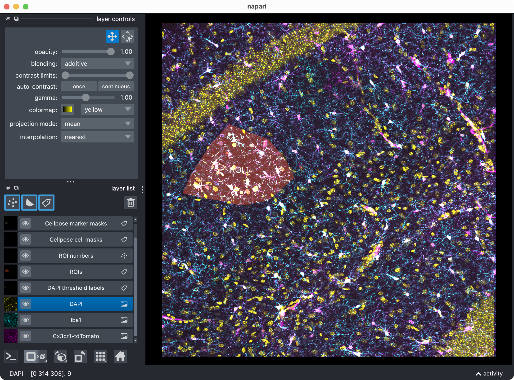
   
   2D-projection of the original 3D stack, showing the microglia (magenta), Iba1 (cyan), and optional third channel (yellow), along with the segmentation layer of the microglia cells that are positive for both marker channels.

What you see here is no longer the original full 3D stack. Instead, CellColoc
shows the projected analysis view and the corresponding segmentation layers.

This is intentional. Once you choose a z-projection, all downstream
segmentation and result inspection should refer to the same projected data.

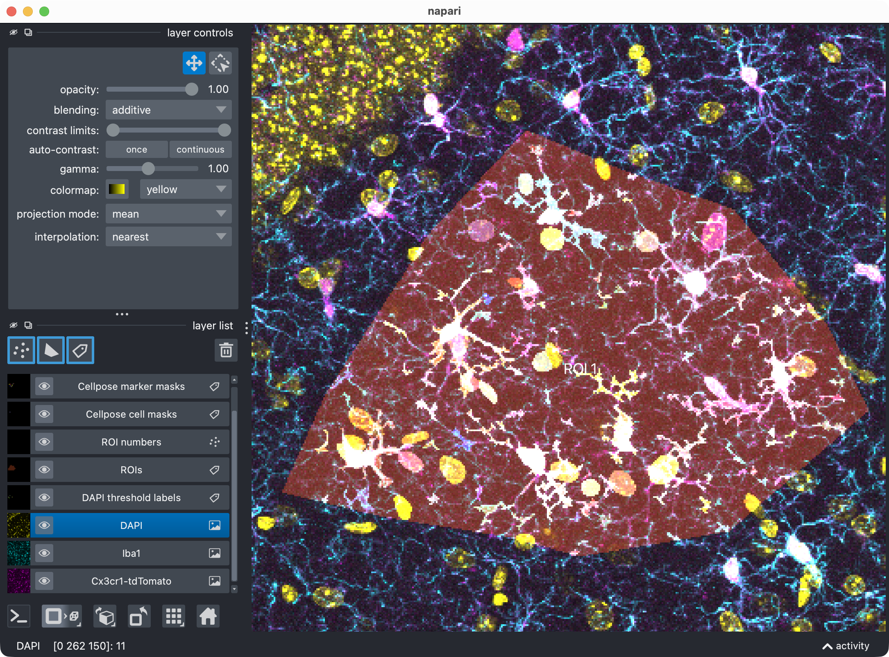
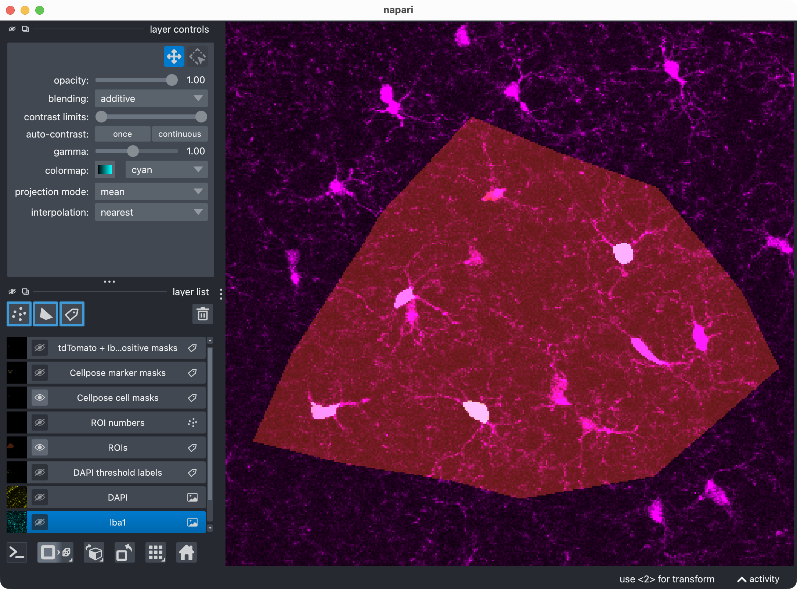
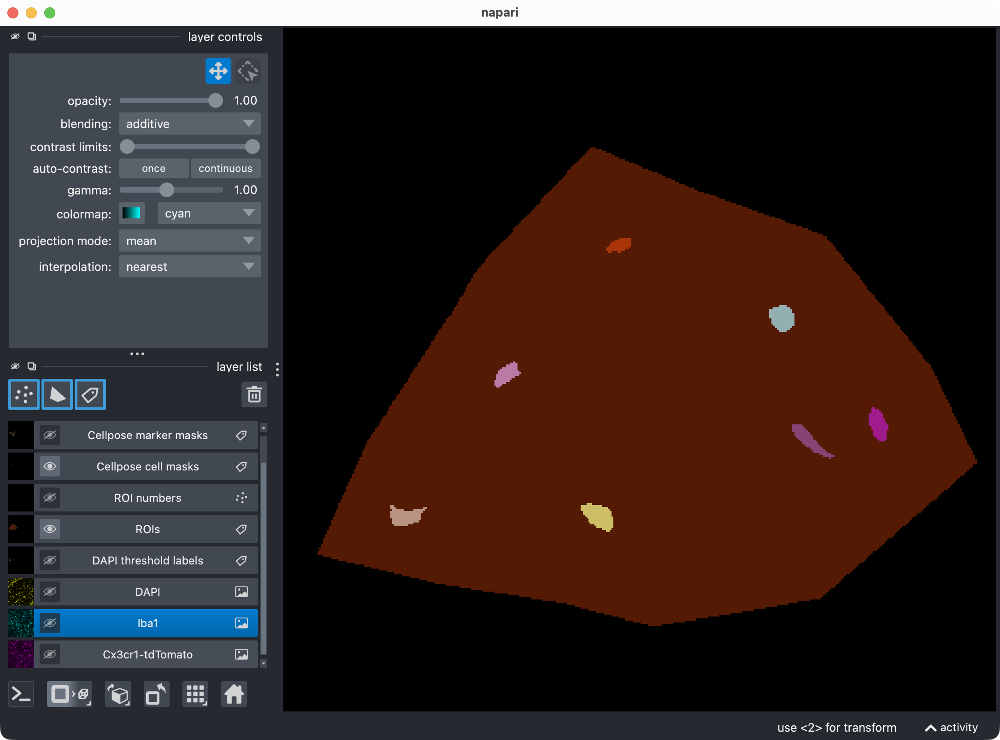
   
   Top: Zoom onto the analyzed ROI, showing all channels and their segmented label layers. Center: Microglia channel only. Bottom: Segmentation layer of the microglia channel, showing the Cellpose-segmented cell objects. Note that we miss some microglia cells in the center of the ROI. We will try to recover them in the optional refinement step below.

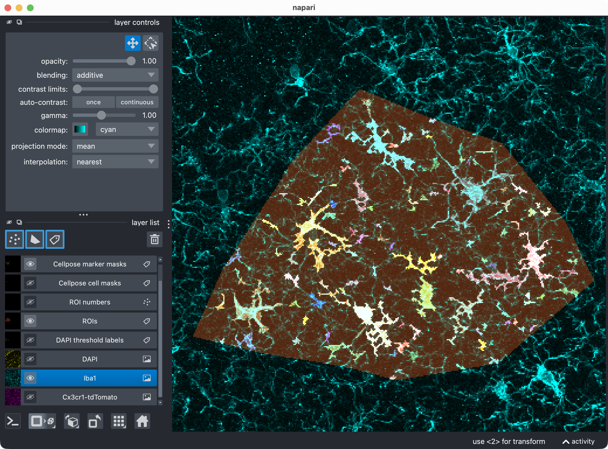
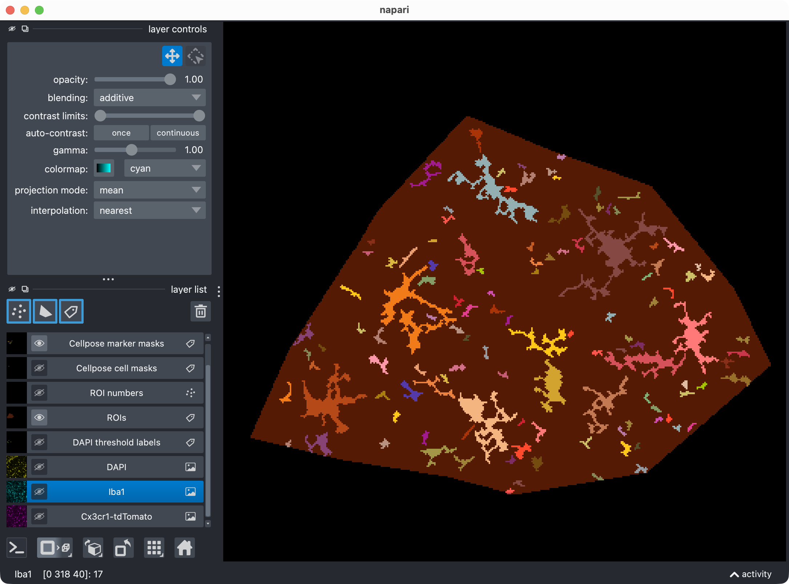
   
   Top: Zoom onto the analyzed ROI, showing the marker channel and its segmented label layer. Bottom: Marker channel only. The marker channel is segmented with Otsu thresholding, which results in a rather rough mask. However, since we are only interested in per-cell positivity (which microglia is Iba1-positive?), this is sufficient for the current demonstration.

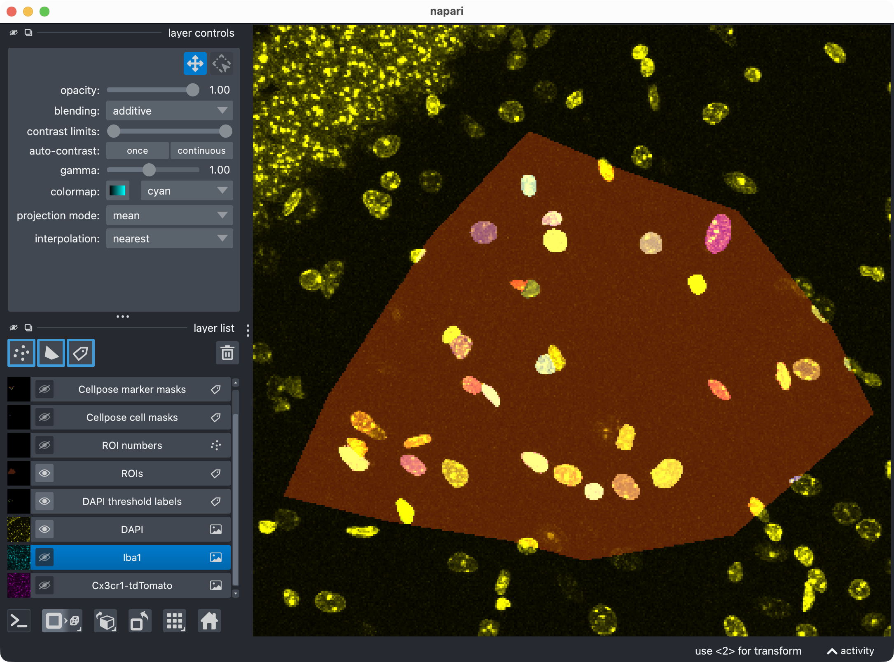
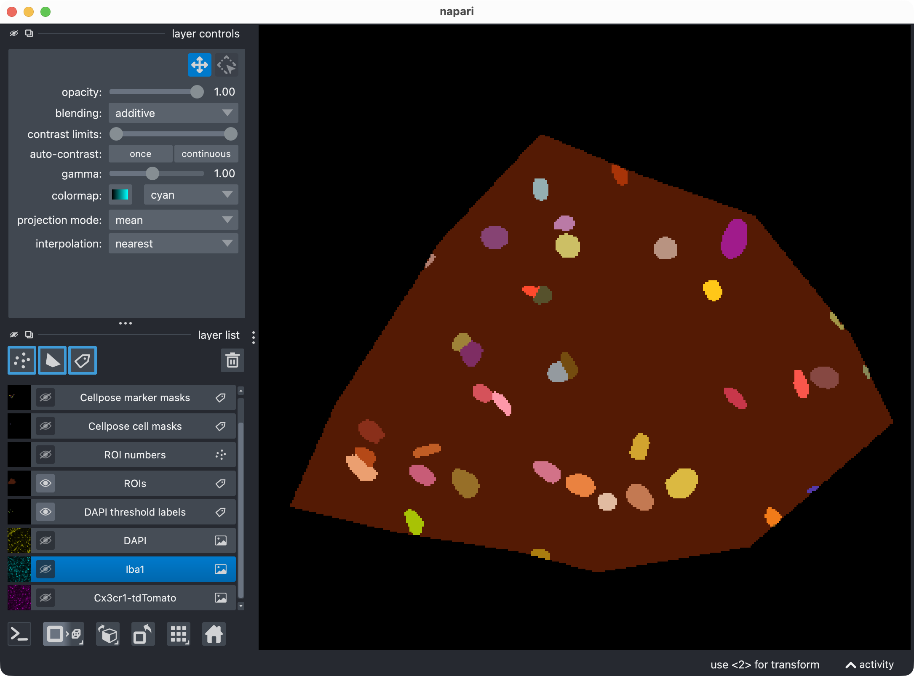
   
   Top: Zoom onto the analyzed ROI, showing the optional third channel and its segmented label layer. Bottom: Segmented third channel only. The optional third channel is segmented with Cellpose, which results in an almost perfect mask this time. Cellpose's segmentation quality can vary across channels and tends to work best for more "roundish" objects (the microglia's processes complicate the Cellpose segmentation).

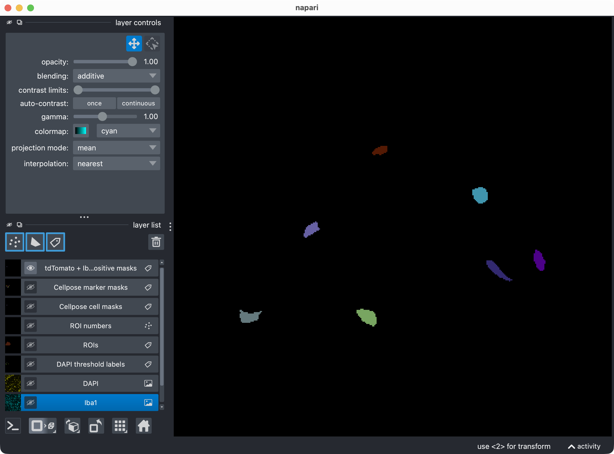
   
   Microglia segmentation layer, including only cells that are both Iba1-positive and DAPI-positive. This is the most specific view of the three-channel analysis, showing only microglia that are positive for both marker channels. It demonstrates that the optional third channel can be used to refine the per-cell positivity analysis and create more specific subsets of cells.

Optionally refine the projected result and visualize the updated result
-----------------------------------------------------------------------

The next cell optionally refines the result after the first inspection:

.. literalinclude:: ../../user_scripts/microglia_3D_three_channel_zproject_user_script.py
   :language: python
   :start-after: # %% OPTIONALLY REFINE ALL THREE CHANNELS WITH CACHED CELLPOSE OUTPUTS
   :end-before: # %% OPTIONALLY REANALYZE MANUALLY EDITED LABEL LAYERS FROM NAPARI

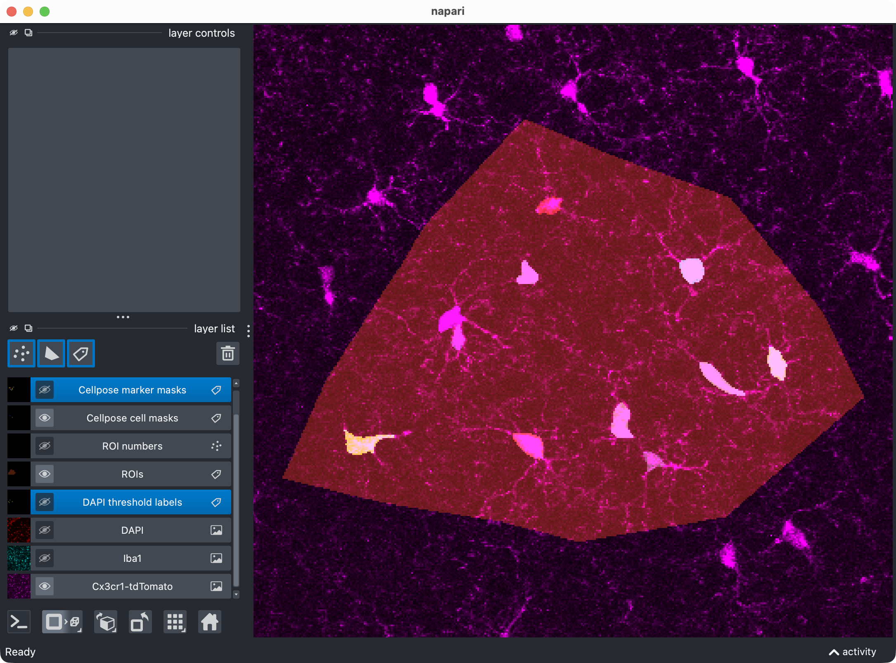
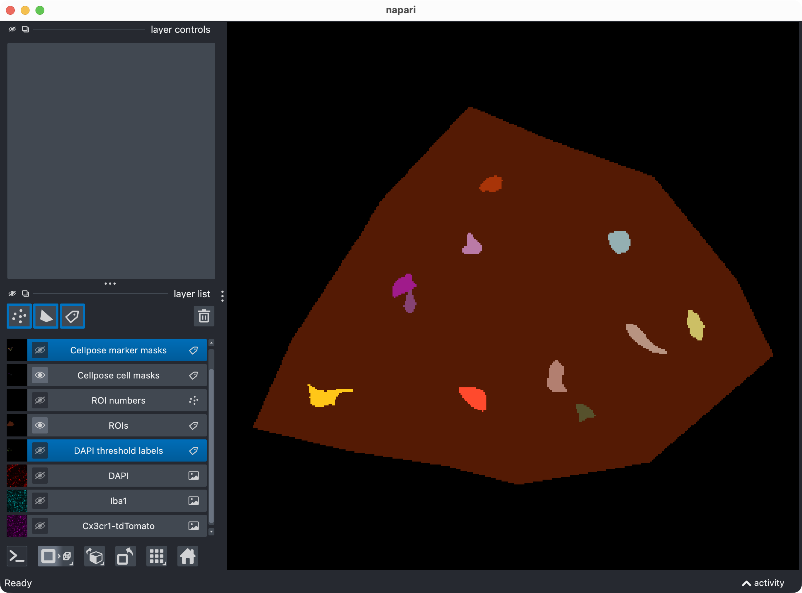
   
   Refinement results for the microglia channel. Initially, the Cellpose segmentation of the microglia channel missed some cells in the center of the ROI. By activating the refinement block, we can recover some of these missed cells without having to rerun the full initial segmentation. The refinement uses cached Cellpose outputs to adjust the segmentation masks post hoc.

This refinement block serves two purposes:

- it lets you tighten or relax Cellpose-derived masks without rerunning the
  full initial segmentation,
- and it shows that the projected workflow can still be refined
  interactively.

In the current script:

- the cell channel can be refined through cached Cellpose outputs,
- the third channel can also be refined because it was initially segmented
  with Cellpose,
- the marker channel keeps its original Otsu-based segmentation in the current
  demo, because threshold-based channels do not provide Cellpose refinement
  caches.

Important settings
~~~~~~~~~~~~~~~~~~

``REFINE_WITH_CACHED_CELLPOSE_OUTPUTS``
   master switch for the refinement step.

``REFINEMENT_ANALYSIS_Z_CROP``
   optional z interval that is applied *before projection* for the refinement
   run. If left as ``None``, the original projection span is reused.

``REFINED_*_CELLPROB_THRESHOLD`` and ``REFINED_*_FLOW_THRESHOLD``
   Cellpose threshold parameters for the channels that were initially
   segmented with Cellpose.

``REFINED_*_POSTFILTERS``
   optional post hoc filters such as ``"min_intensity"``,
   ``"local_contrast"``, or ``"bright_pixel_support"``. In this projected
   demonstration script they are left at ``None`` by default.

The block already contains the full parameter structure, so you can activate
these filters later without having to rewrite the workflow.

Optionally reanalyze manually edited label layers from napari
-------------------------------------------------------------

If you edit the label layers manually in napari, the next cell can rebuild the
tables from your edited masks:

.. literalinclude:: ../../user_scripts/microglia_3D_three_channel_zproject_user_script.py
   :language: python
   :start-after: # %% OPTIONALLY REANALYZE MANUALLY EDITED LABEL LAYERS FROM NAPARI
   :end-before: # %% VISUALIZE CELLS POSITIVE FOR CHANNEL 0 + CHANNEL 1

This is useful when:

- you want to merge or split labels manually using napari's label editing tools,
- you want to remove obvious segmentation artifacts by hand,
- or you want to produce a final polished result table from curated masks.

The reanalysis uses the currently displayed label layers from the open napari
viewer rather than loading masks from disk.

Visualize cells positive for channel 0 + channel 1
--------------------------------------------------

The next cell creates a dedicated positivity view for channel 0 against
channel 1:

.. literalinclude:: ../../user_scripts/microglia_3D_three_channel_zproject_user_script.py
   :language: python
   :start-after: # %% VISUALIZE CELLS POSITIVE FOR CHANNEL 0 + CHANNEL 1
   :end-before: # %% VISUALIZE CELLS POSITIVE FOR CHANNEL 0 + CHANNEL 2

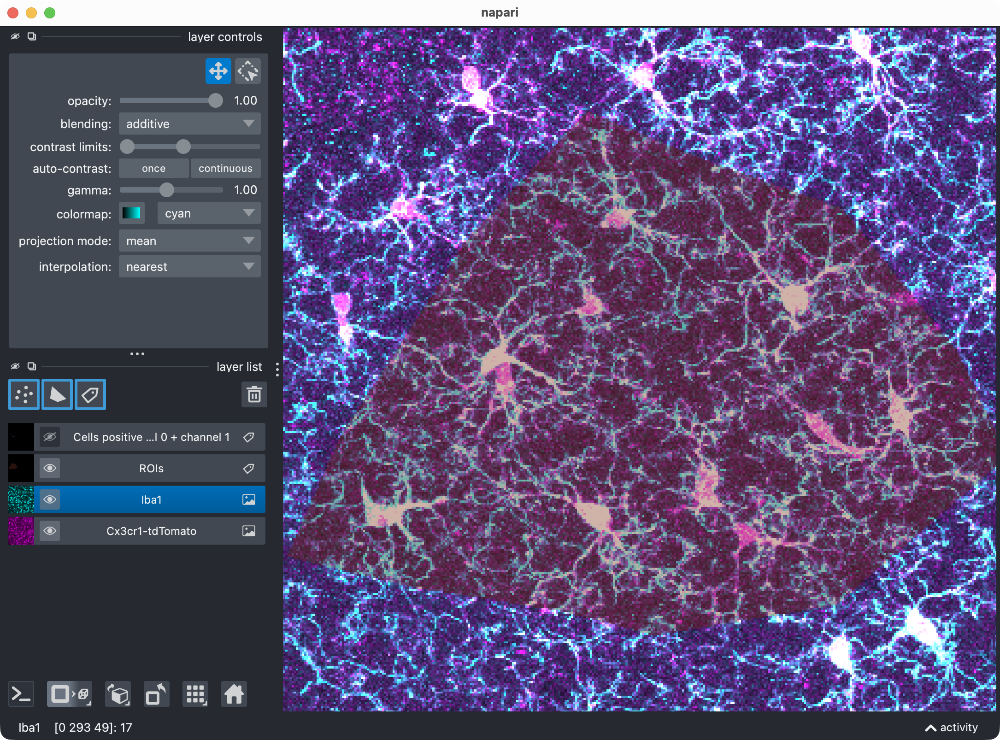
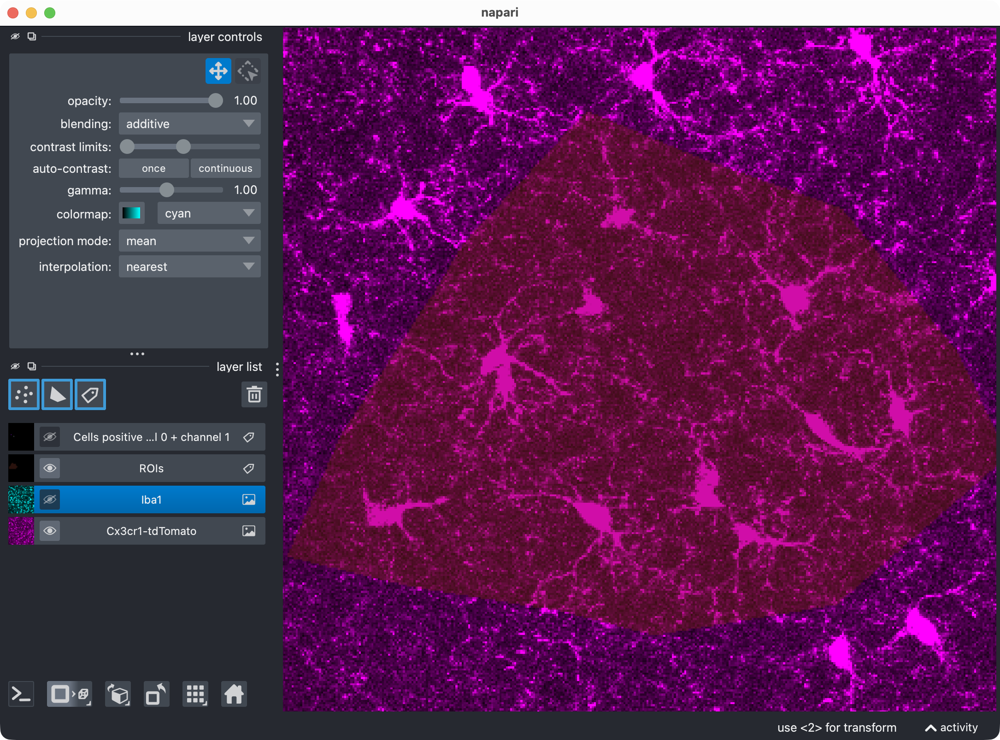
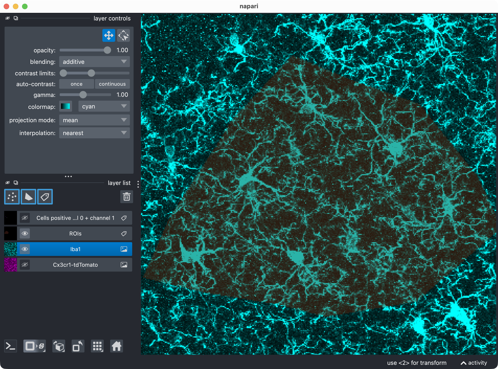
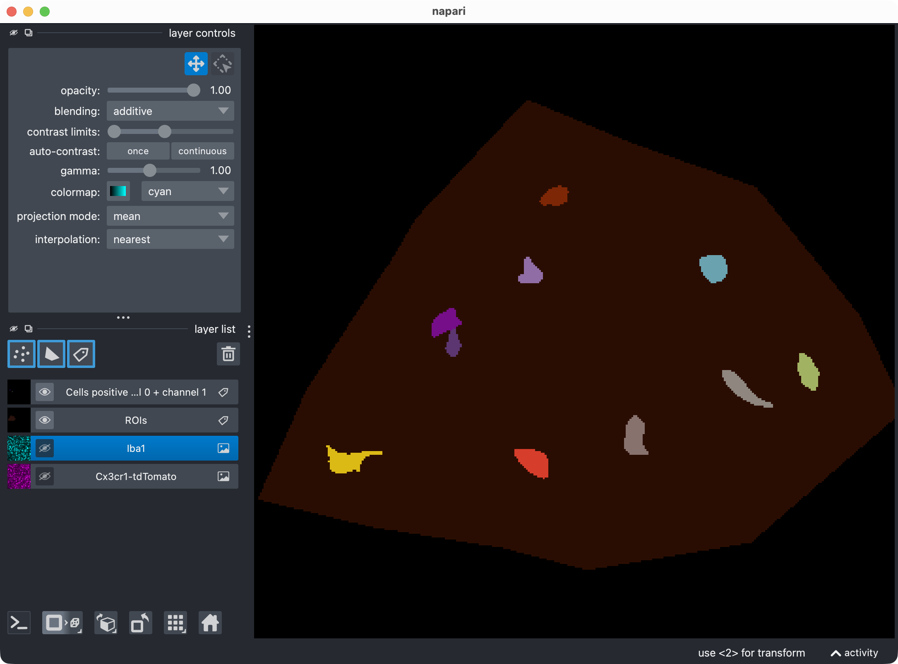
   
   Top: Zoom onto the analyzed ROI, showing the microglia, Iba1, and the resulting segmentation layer of the microglia cells that are positive for Iba1. Center top: The microglia channel only. Center bottom: The Iba1 channel only. Bottom: Segmentation layer of the Iba1-positive cells. This view shows which microglia cells are positive for the Iba1 marker, based on the projected analysis and segmentation results.

This view shows:

- the projected cell image,
- the projected marker image,
- the ROI layer,
- and only those channel-0 cell masks that are positive against channel 1.

Visualize cells positive for channel 0 + channel 2
--------------------------------------------------

The following cell creates the dedicated positivity view for channel 0 against
channel 2:

.. literalinclude:: ../../user_scripts/microglia_3D_three_channel_zproject_user_script.py
   :language: python
   :start-after: # %% VISUALIZE CELLS POSITIVE FOR CHANNEL 0 + CHANNEL 2
   :end-before: # %% VISUALIZE CELLS POSITIVE FOR CHANNEL 0 + CHANNEL 1 + CHANNEL 2

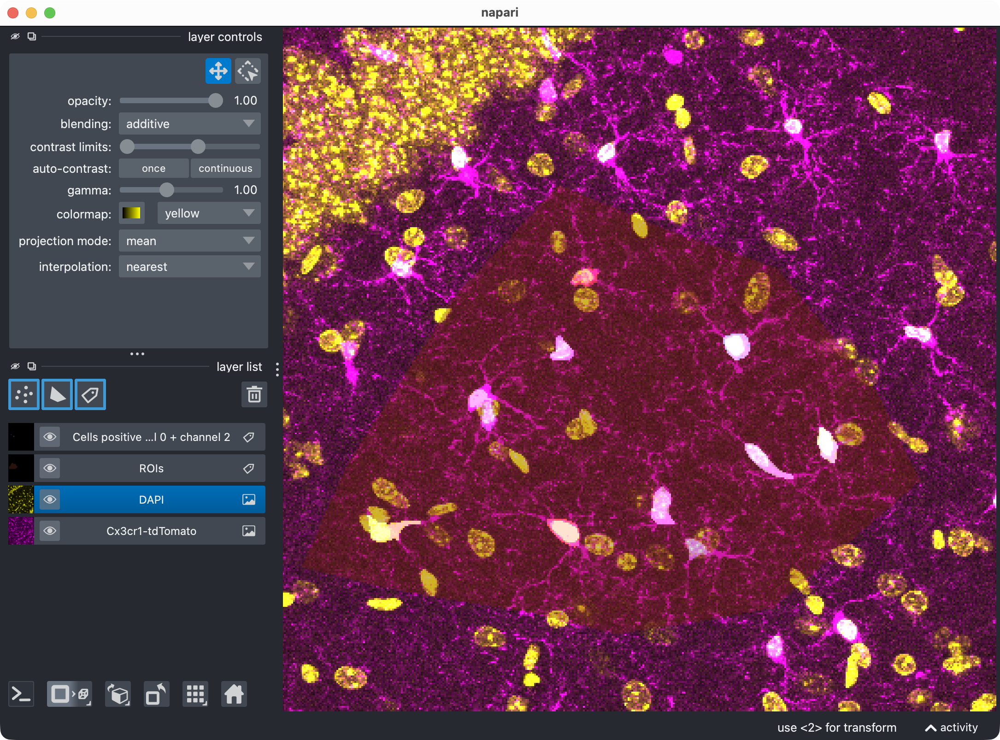
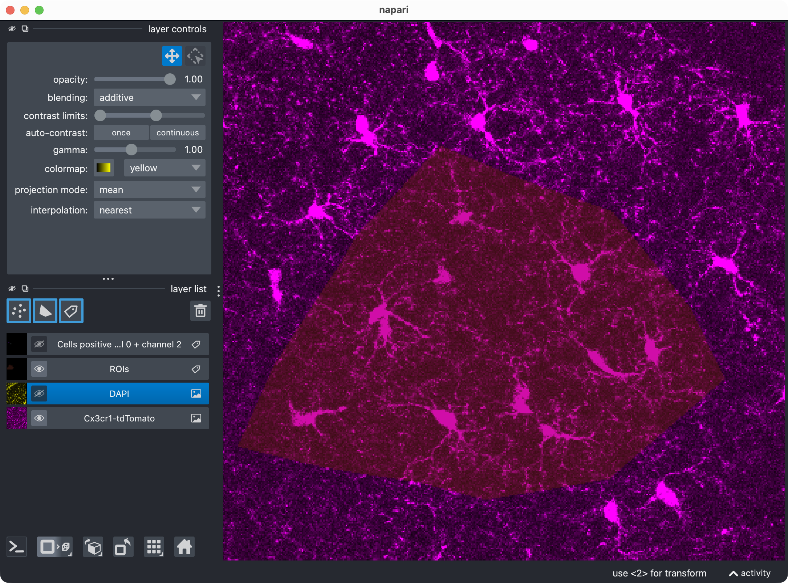
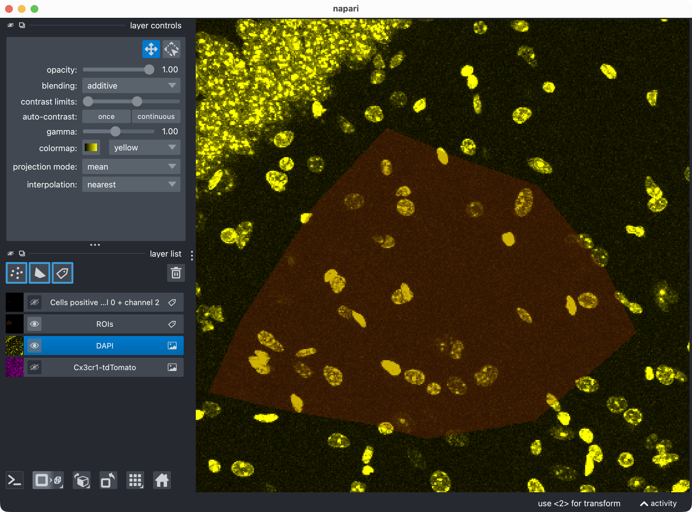
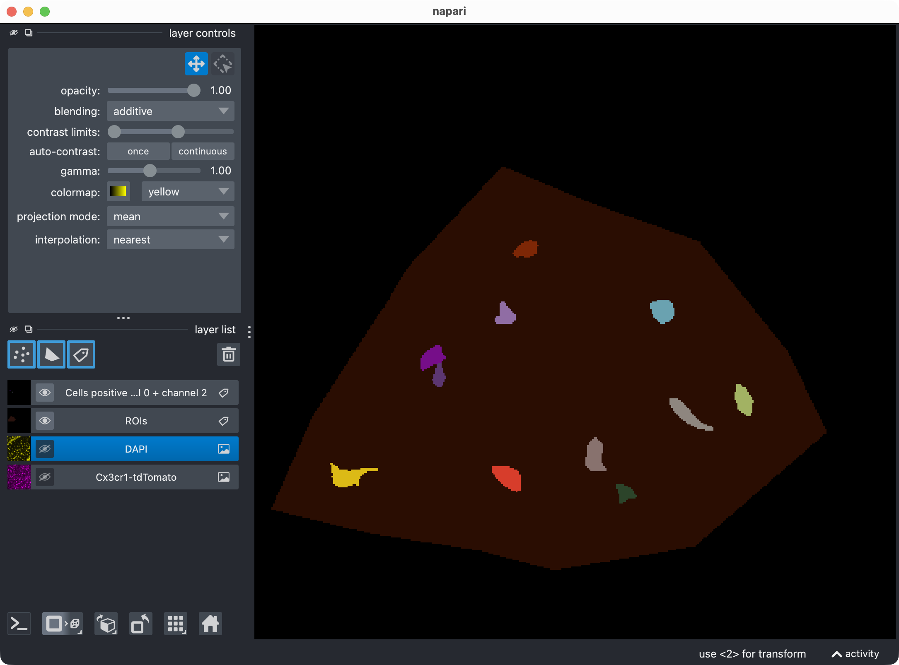
   
   Top: Zoom onto the analyzed ROI, showing the microglia, DAPI, and the resulting segmentation layer of the microglia cells that are positive for DAPI. Center top: The microglia channel only. Center bottom: The DAPI channel only. Bottom: Segmentation layer of the DAPI-positive cells. This view shows which microglia cells are positive for the DAPI marker, based on the projected analysis and segmentation results.

This is the optional-third-channel analogue of the previous view.

Visualize cells positive for channel 0 + channel 1 + channel 2
--------------------------------------------------------------

The next cell creates the combined double-positive view:

.. literalinclude:: ../../user_scripts/microglia_3D_three_channel_zproject_user_script.py
   :language: python
   :start-after: # %% VISUALIZE CELLS POSITIVE FOR CHANNEL 0 + CHANNEL 1 + CHANNEL 2
   :end-before: # %% EXPORT RESULTS

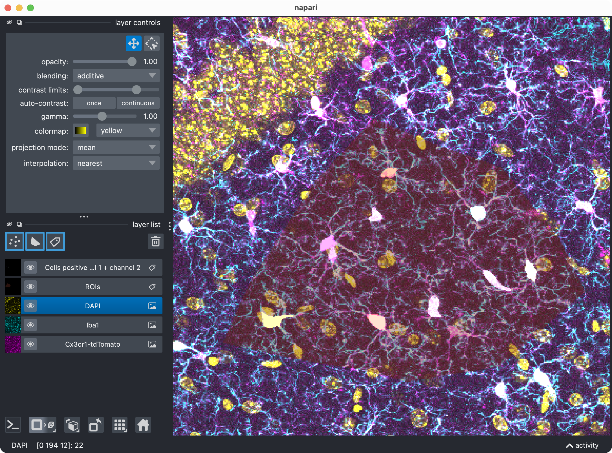
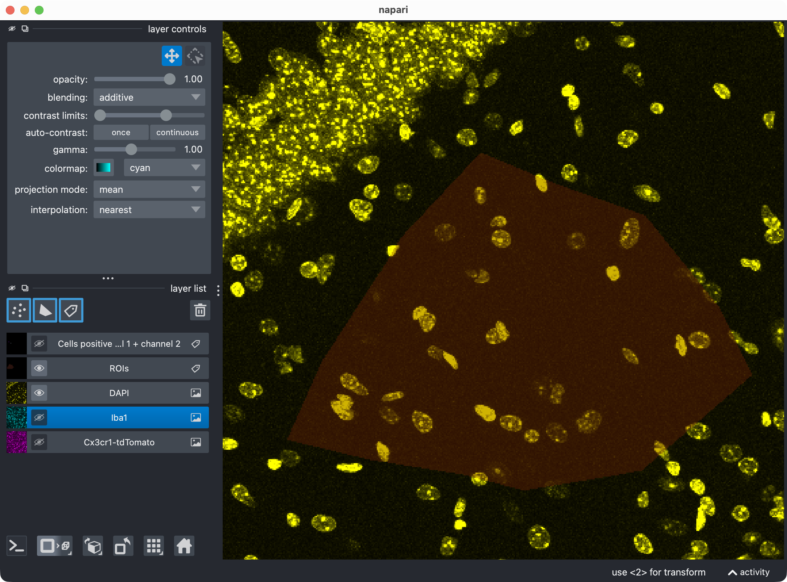
   
   Top: Zoom onto the analyzed ROI, showing the microglia, Iba1, DAPI, and the resulting segmentation layer of the microglia cells that are positive for both Iba1 and DAPI. Bottom: Segmentation layer of the Iba1- and DAPI-positive cells.

This final positivity view is often the most biologically restrictive one. It
shows only those channel-0 cells that satisfy both positivity conditions at
the same time.

Export results
--------------

The last cell exports the final run result:

.. literalinclude:: ../../user_scripts/microglia_3D_three_channel_zproject_user_script.py
   :language: python
   :start-after: # %% EXPORT RESULTS
   :end-before: # %% END

This writes the standard CellColoc outputs to the ``results/`` directory
associated with the current input file, including:

- exported masks,
- ROI masks,
- summary tables,
- and the Excel workbook with the main analysis results.

At this point, the projected three-channel workflow is complete.
